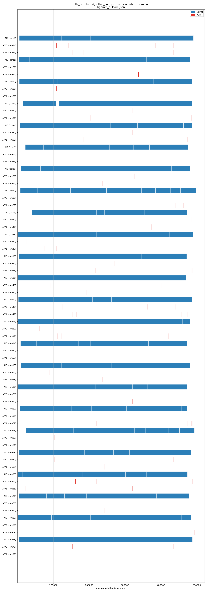

# AICore 上的全分布式 Runtime

本文档定义 **simpler** 的一种运行模式：编排（orchestration）、调度（scheduling）
与执行（execution）全部以 SPMD 方式运行**在 AICore 自身**之上，**AICPU 完全不参与**。
不存在独立的调度器：每个核自行构建、拥有并执行自己的任务。

这是一份自洽的设计。第一部分描述系统如何工作（核的行为 + 伪代码）；第二部分列举
各数据结构及其共享特性（全局共享 / 每核私有 / 每核复制）。

本设计所替代的、当前以 AICPU 为中心的模型，参见
[chip-level-arch.md](chip-level-arch.md) 与 [scheduler.md](scheduler.md)。编排编写
API（`rt_submit_aic_task` / `rt_submit_aiv_task`，`pto_orchestration_api.h`）参见
`src/{arch}/runtime/` 下的 `tensormap_and_ringbuffer` runtime。

---

# 第一部分 — 系统设计

## 1. 概述

- 编排函数**被加载并同时运行在每一个参与的 AICore 上**（SPMD）。所有核执行完全相同
  的编排程序。
- 每个核同时是**编排器 + 调度器 + worker**。经典的“调度器↔worker”握手（任务门铃、
  ready 队列、完成邮箱、依赖连线线程）被**彻底取消**。
- 面向编排的 API 保持不变。通用原语是 `rt_submit_task(MixedKernels, args)`；
  `rt_submit_aic_task` / `rt_submit_aiv_task` 只是它的轻量便捷封装（**不存在**
  `rt_submit_mixed_task`——MIX 任务就是一个填了多个 kernel 槽的 `MixedKernels`）。
  在这些 API 背后，runtime 决定所有权、在本地构建任务，随后由同一个核执行它。
- AICPU 不在编排与调度的关键路径上。

本设计建立在以下四个支柱之上（下文逐一展开）：

1. 任务所有权的**抢占竞争（claim race）**（§2）。
2. **owner = builder = executor**，并配合核类型匹配（§3）。
3. 用于依赖发现的**每核全量复制 TensorMap**（§4）。
4. **每核私有任务环 + 一个全局完成标志环**，驱动一个采用拉取式依赖解析的
   run-ahead 执行循环（§5–§6）。多核任务另加：**每 lane 单向 SPSC launch 箱**，
   且 **依赖仅由 winner 收敛**后再通知 follower（§3.1）。

## 2. 任务所有权 —— 抢占竞争（Claim Race）

所有核走**完全相同**的、确定性的 submit 序列。任务身份就是它在该序列中的位置：第 N 次
`rt_submit_*` 调用在每个核上都是**任务 id `N`**，与最终由谁执行无关。

所有权由以下两个量驱动：

| 计数器 | 作用域 | 含义 |
| ------ | ------ | ---- |
| `claim_cursor[T]`（`cube_cursor`、`vector_cursor`） | **全局、原子** | 类型 `T` 已被认领任务 id 的高水位线。共**两个** cursor（cube = AIC-anchored，vector = AIV-only），二者都索引同一个共享 id 空间（§3.1） |
| `local_current_task_index` | **每核** | 本核走 submit 序列时当前到达的任务 id |

每次 `rt_submit_*`，匹配 anchor 类型的核执行如下逻辑（设 `T` 为此任务类型——若 AIC-anchored
则为 cube，若 AIV-only 则为 vector）：

```text
local_current_task_index++                        # 到达下一个 submit 点 = 任务 id N
if local_current_task_index > claim_cursor[T]:    # 我是否领先于 T 的高水位线？
    # 本核是 T 类型中走得最靠前的 → 它 WIN，拥有任务 N。
    claim_cursor[T] = local_current_task_index     # 发布（原子）
    own = true
else:
    # 已有一个 T 类型的核更早认领了此 id（它跑在前面）。
    own = false
```

胜者是该任务 id 的唯一 owner。所有权决定的是*谁来构建与执行*；它**不会**改变任务 id——
该 id 是处处使用的确定性 submit 序号（完成标志环的索引、以及每个核的 producer 引用）。
对于多核任务，胜者是 *anchor*；与它配对的同 block 核共同拥有其余子任务（§3.1）。

为什么需要两个 cursor（以及为什么单一共享 cursor 是错的）在 §3.1 解释：两个 cursor 扫过
同一 id 空间，各自只认领自己类型的 id，并**跨过**另一类型的 id，因此落后类型尚未认领的
id 只是在等待它自己的 cursor —— 它们绝不会被跳过。

> 确切原子原语（`atomic_fetch_max`，无则 CAS 回路）与内存序在 §11.1 定为规范；
> 语义上每个任务 id 恰好有一个 anchor 胜出。

## 3. owner = builder = executor；核类型匹配

**抢到任务的提交者就是它的 owner。** owner 同时负责任务的**创建**（构建
descriptor/payload、记录 fan-in producer id）与**执行**（调用 incore 函数）。一个核只会
认领它自己能执行的类型的任务。

任务由 `MixedKernels` 描述，最多携带三个子任务槽：

```cpp
struct MixedKernels {
    int32_t aic_kernel_id  { INVALID_KERNEL_ID };   // AIC 子任务
    int32_t aiv0_kernel_id { INVALID_KERNEL_ID };   // AIV 子任务 0
    int32_t aiv1_kernel_id { INVALID_KERNEL_ID };   // AIV 子任务 1
};
```

`active_mask` = 哪些槽有效，它恰好记录了一个 MIX 任务的 AIV 数量——**1C+1V**
（`aic` + `aiv0`）还是 **1C+2V**（`aic` + `aiv0` + `aiv1`）。这一区分对所有权很关键：
1C+1V 任务只绑定 AIV0_c，让 AIV1_c 保持空闲（§3.1）。因此任务是以下之一：AIC-only、
AIV-only（1 个或 2 个 AIV 子任务）、或 **MIX**（AIC + 1 个或 2 个 AIV 子任务）。

| 任务形态 | 子任务槽 | owner |
| -------- | -------- | ----- |
| **AIC-only** | `aic` | 任意一个 AIC 核 |
| **AIV-only (1V)** | `aiv0` | **任意一个 AIV 核（AIV0 或 AIV1）** |
| **AIV-only (2V)** | `aiv0`、`aiv1` | 同一 block 的两个 AIV 核 |
| **MIX (1C+1V)** | `aic`、`aiv0` | 一个 AIC + 同 block 一个 AIV（共同 owner） |
| **MIX (1C+2V)** | `aic`、`aiv0`、`aiv1` | 一个 AIC + 同 block 两个 AIV（共同 owner） |

单槽封装（`rt_submit_aic_task` → 填 `aic`，`rt_submit_aiv_task` → 填 `aiv0`）是常见路径；
多槽任务直接走 `rt_submit_task(MixedKernels, …)`。

**单核 vs 多核——竞争资格按“类型”而非“固定槽角色”。** 竞争一个任务的资格由任务**类型**
（cube / vector）决定，而非某个具体的 `aiv0`/`aiv1` 角色：

- **单核任务（1C、1V）**：没有配对、没有 anchor/follower。任意一个**匹配类型**的核通过 §2 的
  claim race 认领，胜者独自构建并执行那唯一的子任务。特别地，**1V（AIV-only 单核）由所有 AIV 核
  竞争——AIV0 与 AIV1 同等参与**；胜者执行 `aiv0_kernel_id`，与它在 block 中是 AIV0 还是 AIV1
  无关（两者都是 vector 核，可执行任意 AIV kernel）。
- **多核任务（2V、MIX）**：需要同一物理 block 的多个核共同拥有，走 §3.1 的固定配对（anchor 胜出
  后把其余子任务推送给同 block 伙伴）。

换言之，`aiv0`/`aiv1` 的“固定角色”**只**在多核任务里用来把子任务映射到 block 内具体的核；对单核
任务它不构成竞争限制。

### 3.1 通过固定物理配对实现多核任务的共同所有权

本节**只针对多核任务**（任意 MIX 任务，以及 2V 的 AIV-only 情况）——它们含多于一个有效子任务
槽，必须被多个核同时拥有。单核任务（1C、1V）不走本节机制：由任意匹配类型的核（1V 即任意 AIV 核
AIV0/AIV1）通过 §2 的 claim race 直接认领、独自执行，无 anchor/follower。本节规定多核任务的
共同 owner 如何被选出、如何达成一致——这是模型中最难的部分。

**配对被 FIXED（固定）到硬件 block。** 核被组织成硬件 block（cluster）；在本平台上一个
block = **1 AIC + 2 AIV**（AIV0、AIV1）。这个 block 是永久的共同所有权单位：AIC_c 与
AIV0_c、AIV1_c 静态配对。不存在动态配对选举。子任务槽到 block 内角色是固定映射：

| 子任务槽 | 由谁执行（block `c` 内） |
| -------- | ------------------------ |
| `aic_kernel_id` | AIC_c |
| `aiv0_kernel_id` | AIV0_c |
| `aiv1_kernel_id` | AIV1_c |

**Anchor + 同 block 跟随规则。** 一个多核任务只被**认领一次**，由一个 *anchor* 核认领；
其 block 的其余核跟随：

1. **谁竞争（anchor 类型）**：竞争按任务**类型** `T` 进行——含 AIC 子任务的任务（所有 MIX）
   是 **cube 类型，只有 AIC 核竞争**；纯 AIV 的 2V 是 **vector 类型，由所有 AIV 核（AIV0/AIV1）
   竞争**。胜出者即该任务的 **anchor**，它执行**自己物理角色**对应的那个槽（AIC 胜者执行 `aic`；
   2V 由某个 AIV 胜出则执行它自己角色的 `aiv0`/`aiv1`），其余激活槽推送给同 block 伙伴。
   **MIX 的 vector co-owner 绝不靠自己竞争得来**——它*完全*由“哪个 AIC 胜出”决定，即由胜者
   所在的 block 决定（一个 AIV 核绝不会因为先到达就赢得某 MIX 的 vector 子任务）。
2. 抢占竞争（§2）**仅在 anchor 类型之间**进行，竞争对象是 `cursor[T]`。胜出的
   anchor 核所在的 **block** 成为拥有该任务的 block。anchor **一次性解析整个任务的
   fan-in**（本地 TensorMap，§4），把*自己*那个槽的子任务构建进自己的私有环（带
   `fanin[]`）。**多核任务的依赖只由 winner/anchor 收敛**：anchor 在 Phase B 中轮询
   `task_completed_flag`；**fan-in 全部就绪之后**，才向同 block 各 follower lane 的
   **单向 SPSC launch 箱**（`lane_inbox[block][lane]`）release 一条 **launch**——
   含该 lane 执行所需的 kernel/args（**不含** fan-in 列表）。joint 完成计数
   `remaining = popcount(M)` 记在全局 `task_cell[N]`（与完成标志同槽族），不放在
   block 多方共享控制表里。
3. 同 block 的 follower **既不竞争、也不在编排走位上等待 anchor 决定**——永不因
   “本 block 是否赢了 N”而阻塞。所有权与可执行性都靠 anchor 的推送：follower
   **异步 drain** 自己的 `lane_inbox`；收到 launch 即视为**依赖已满足**，私有环槽
   `fanin_count = 0`，**不再**自行轮询 fan-in。编排走到 MIX 时只做 §4 TensorMap
   更新后继续，不做所有权判断、不等待 anchor。

**依赖所有权（winner-gated readiness）。**

| 角色 | 解析 fan-in | 轮询完成标志 | 何时可执行 |
| ---- | ----------- | ------------ | ---------- |
| Winner / anchor | 是 | 是（自己的 Phase B） | fan-in 就绪 |
| Follower | 否 | 否（对该 joint 任务） | 收到 launch |
| 未激活 lane / 他 block | 否 | 否 | 不执行该任务 |

Launch 只表示**依赖已满足**，**不**表示 winner 的 kernel 已跑完——AIC 与 AIV 在
deps 解除后仍可并行。非一致缓存平台上，follower 进 kernel 前仍须按 launch 中的
输入地址做 invalidate / 旁路读（§11.5）；ready 不能代替数据面可见性维护。

**为什么是 anchor 推送，而不是 follower 自己走位 + 等待。** 两个 cursor 独立推进
（§2），cube/vector 可错位。若 follower 走到 N 再判断本 block 是否赢了 N，anchor
落后时无法区分“尚未认领”与“别的 block 赢了”，只能阻塞——会把 vector 吞吐绑死在
cube 上。**改为 anchor 推送即消除这种 per-task 阻塞**：

- **cube 落后时**：`lane_inbox` 尚无该 MIX 的 launch → AIV **不等待**，继续做
  AIV-only 工作（及已到的其他 launch）。零停顿。
- **cube 领先时**：launch 在 inbox 中累积 → AIV 有空槽就 drain。inbox 满则
  anchor **暂缓认领新多核任务**（反压；转去 Phase B），不让 cube 无限超前。

每 lane 一条 SPSC（单写单读）允许多个在飞 joint 任务；目标 follower 由静态
block 配对唯一确定，无需跨 block 协商。

> 唯一残留的等待发生在**收尾**：若某 block 的 anchor 严重落后，它的 follower 在做完自己其余
> 全部工作、私有环清空后，可能要在终止前空转，等 anchor 把最后的多核子任务推送过来（§7）。
> 这是固定配对的固有代价——多核子任务的归属由 anchor 的认领决定；它不是 per-task 的串行阻塞，
> 而只是尾部的一次空转，且在 cube 密集（cube 领先）的常见场景下根本不出现。

**按形态的行为（设胜出 anchor 在 block `c`）：**

| 任务形态（`active_mask`） | 谁竞争 | Anchor（胜者） | 被推送子任务的 follower | 同 block 未被绑定（保持空闲） |
| ------------------------- | ------ | -------------- | ----------------------- | ----------------------------- |
| **1C + 2V**（多核） | 所有 AIC | AIC_c | AIV0_c、AIV1_c | — |
| **1C + 1V**（多核） | 所有 AIC | AIC_c | AIV0_c | **AIV1_c** |
| **2V**（多核，AIV-only） | 所有 AIV（AIV0/AIV1） | 胜出的那个 AIV_c | 同 block 的另一个 AIV_c | AIC_c |
| **1C**（单核，AIC-only） | 所有 AIC | 胜者独自执行，无配对 | — | （不涉及 block 配对） |
| **1V**（单核，AIV-only） | **所有 AIV（AIV0/AIV1）** | 胜者独自执行，无配对 | — | （不涉及 block 配对） |

多核任务（前三行）的 follower 身份都由 anchor 所在 block 唯一确定——不存在跨 block 协商。单核
任务（后两行）没有 anchor/follower，胜者是哪个核就由哪个核独自执行；**1V 由 AIV0 与 AIV1 同等
竞争**。

**未被绑定的 block 伙伴不是闲着——它对其他任务保持空闲可用。** 当一个 block 赢得一个不激活
某 block 伙伴槽位的任务时，那个核就**不被该任务占用**，且**绝不能**因它而阻塞或等待。它继续
运行自己的编排，继续竞争并拥有其类型的其他任务。具体地：

- 一个 **1C+1V** 任务只绑定 AIC_c + AIV0_c。**AIV1_c 是空闲的**，可继续竞争、认领并执行其他
  AIV 任务（它自己竞争到的任意 1V/2V AIV-only 任务，或本 block 后续某个 1C+2V 任务的 AIV1 槽）。
- 一个 **1C（AIC-only）** 任务只绑定一个 AIC 核；AIV 核**都**对 AIV 工作保持空闲。
- 一个 **1V（AIV-only）** 任务是单核：由**任意一个 AIV 核（AIV0 或 AIV1）**竞争得到并独自执行，
  其余 AIV 核与 AIC 核保持空闲。它不绑定任何固定角色。

这是模型的自然结论：每个核都走相同的确定性 submit 序列，并逐任务判断自己的槽是否激活。在某个
自己的槽未激活的 submit 点，该核就是不绑定该任务（但它仍执行 §4 的无条件 TensorMap 更新），
然后继续——去认领它下一个有资格的任务。每个任务记录的 `active_mask`（1C+1V vs 1C+2V 等）
就是告诉每个 block 伙伴自己是被绑定还是空闲的依据。

**多核任务只有一个完成标志。** 即使有多个共同 owner，一个任务也恰好只有一个全局
`task_completed_flag[N]`。每个共同 owner 执行自己的子任务后，递减 `task_cell[N].remaining`
（初始化为 `popcount(active_mask)`）。把计数器减到零的那个共同 owner 执行唯一一次全局写
`task_completed_flag[N] = true`。消费者只看到一个原子完成信号。各共同 owner 在自己的
子任务完成后立即释放自己的私有环槽位。

**Claim 流一致性 —— 同一任务 id 空间上的两个全局 cursor。**

只有**一个**任务 id 空间——确定性 submit 序列（第 N 次 submit = id `N`），处处用于完成标志
环与 producer 引用。

所有权由**两个全局 claim cursor** 决定，二者都由所有核共享，且都索引进*同一个* id 空间：

- `cube_cursor` —— 已认领的 **cube（AIC-anchored）** 任务 id 的高水位线（AIC-only 与所有
  MIX 任务）。
- `vector_cursor` —— 已认领的 **vector（AIV-only）** 任务 id 的高水位线。

一个到达类型 `T` 的任务 `N` 的核，当且仅当 `N > cursor[T]` 时赢得它；赢得后把 `cursor[T]`
推进到 `N`。一个核只会推进它自己类型的 cursor；它**跨过**另一类型的 id 而不去碰它。

两个 cursor 在共享 id 空间上**独立**推进，因此任意时刻其中一个可能领先于另一个。**推进一个
cursor 不会认领它跨过的另一类型的 id。** 因此在领先 cursor 与落后 cursor 之间的 id 区间里
可能存在**尚未认领的空洞**——这些是*落后*类型的、还没有任何核到达的 id。这是正确的，不是 bug：
一个空洞只表示“暂时还没认领”；当一个该类型的核到达它时，落后类型的 cursor 会把它填上。

```text
任务 id:      0    1    2    3    4    5    6
类型:         C    V    C    C    V    V    C
                              ^cube_cursor=3        (cube 任务 0,2,3 已认领)
                   ^vector_cursor=1                 (vector 任务 1 已认领)
空洞: id 4 和 5 是位于 cube_cursor 之下的 vector 任务——仍 UNCLAIMED，
      等待 vector_cursor 推进到它们。没有 orphaning。
```

在单一类型内部不存在空洞：每个核按 id 递增顺序遇到该类型的任务，而 cursor（一个单调高水位线）
总是被设为刚刚认领的那个 id——因此该类型中所有 ≤ 其 cursor 的 id 都已被某个核拥有。（计数器的
确切表示属于实现细节——§11。）

**取舍。** 固定配对消除了一切跨 block 协商，并把唯一的共享协调状态保持在 **block-local**
（1 AIC + 2 AIV 共享一小块区域），而非全局 per-task。代价是多核任务没有跨 block 的负载均衡；
动态配对方案是未来的改进（§11）。

### 3.2 为什么 vector 不竞争 MIX（以及“不会缺失 co-owner”的论证）

> 这一节直接回答一个常见疑问：既然 vector 不参与 MIX 的竞争，会不会出现“cube 认领了某个 MIX
> 任务，却没有任何 vector 核作为它的 co-owner”？答案是**不会**。并解释为什么不采用“让 vector
> 也竞争 MIX”或“先到先得、由后到的同 block cube 反向认领”的替代方案。

**结论一：vector 核不参与 MIX 的竞争。** MIX 永远 cube-anchored（§3.1）。vector 核遇到一个
MIX 任务时走的是 follower 路径：它**不**碰 `vector_cursor`，只异步 drain 本
lane 的 `lane_inbox`。它“先到达” MIX 任务这件事不授予它任何东西。

**结论二：永远不会缺失 vector co-owner。** 原因有三条，缺一不可：

1. MIX 任务是 cube 任务，**只**会推进 `cube_cursor`。`vector_cursor` 永远不认领 MIX 任务——
   即便 `vector_cursor` 追上甚至越过 `cube_cursor`，它也只是在认领它路过的 *AIV-only* 任务，
   绝不会“占用”任何 MIX 任务。所以不存在“被 vector_cursor 抢走却没有 vector 执行者”的 MIX 任务。
2. 当某个 AIC 核 `AIC_x` 赢得 MIX 任务 `N` 时，它的 vector co-owner 由**固定物理配对**确定：
   就是同 block 的 `AIV0_x`（若 1C+2V 还有 `AIV1_x`）。这个身份在胜负确定的瞬间就被钉死，
   不需要任何额外竞争或选举。
3. 当 `AIC_x` 赢得 `N` 且 fan-in 就绪后，它向 `AIV0_x`（及 1C+2V 的
   `AIV1_x`）的 `lane_inbox` **release launch**（§3.1）；follower 异步抽取并执行。
   **co-owner 的存在是被保证的。**

**那么 `vector_cursor` 追上 `cube_cursor` 时究竟会发生什么？会不会变成 blocking wait？**
不会。注意 MIX 归属靠 **anchor 推送**而非 follower 走位判断（§3.1），所以：

- **cube 落后（`cube_cursor < vector_cursor`）时**：AIC 还没认领 / 还没发
  launch，`lane_inbox` 为空。AIV **不阻塞**——继续做 AIV-only 工作并 drain 已到的
  launch。编排遇到 MIX 只做 TensorMap 更新，**不**做归属判断、**不**等待 cube。
- 等 AIC 认领 `N` 且 fan-in 就绪后，launch 进入 inbox，AIV 再抽取执行。

换言之，不存在“AIV 走到 MIX 任务就 blocking wait 到 cube 追上来”的情况——这正是把旧设计的
`wait_until(block.anchor_progress >= N)` 去掉、改为推送的原因。唯一残留的等待是**尾部空转**
（§3.1、§7）：若某 block 的 AIC 严重落后，AIV 做完其余全部工作后会在终止前等 AIC 推送最后的
多核子任务。这不是 per-task 串行阻塞，且 cube 领先（常见）时根本不出现。

**为什么不让 vector 也竞争 MIX（方案 A）。** 因为 MIX 的 AIC 与 AIV 子任务必须在**同一物理
block 内协同执行**（共享 local memory / 相互配合，这正是固定配对的意义），所以所有权的单位
是 **block**，不是单个核。若允许 vector 核也去 anchor 一个 MIX 任务，会立刻破坏 §2 的 cursor
不变式：

- 若让 vector 核去推进 `cube_cursor` 来认领 MIX，它就会把位于旧 `cube_cursor` 与 `N` 之间的
  那些 **cube-only 任务 orphan 掉**（跳过且无人认领）——这正是双 cursor 设计要避免的问题。
- 若让 vector 核在 `vector_cursor` 上 anchor MIX，而某个 cube 核同时在 `cube_cursor` 上 anchor
  同一个 MIX `N`，那么同一任务会被两个 cursor 各认领一次 → **两个不同的 block 都认为自己拥有
  `N`**（跨 block 撕裂 / 双重认领）。错误。

因此结论是：**每一类任务必须只有一个 anchor 类**。MIX 选 cube 作为唯一的 anchor 类，保证
claim 是单写者、无 orphan、无跨 block 双重认领。

**为什么“先到先得 + 后到的 cube 反向认领”（方案 B）也不采用。** 这个想法只能作为 **block
内部**的“探测优化”（block 内谁先到达 `N` 谁就代表本 block 发布认领），而**不能**跨 block——
跨 block 的正确性仍然要求一条单一的 claim 流，且该流必须是 cube 的（否则就 orphan 掉 cube-only
任务，同方案 A）。也就是说，即便 block 内允许 vector 先“代发布”，真正权威的 anchor 流仍是 cube
的 `cube_cursor`。其收益只是偶尔省去 follower 的一次等待，却显著增加了 block 内两条 cursor
交叉认领的复杂度与正确性论证负担。因此当前**不采用**，仅在 §11 作为未来可选优化列出。

> 一句话总结：vector 不竞争 MIX 是**有意为之**的正确选择。co-owner 由固定配对保证存在；让
> vector 参与只会重新引入 orphan 或跨 block 双重认领。需要权衡的不是“会不会缺 co-owner”，而是
> cube 落后时 follower 的等待——这属于负载均衡/性能问题，留待动态配对方案（§11）解决。

## 4. 依赖发现 —— 每核全量复制 TensorMap

依赖与今天完全一样，从 tensor 的读/写重叠推导，途径是一个把 tensor 区域映射到其
**producer 任务 id** 的 **TensorMap**。本 runtime 的决定是：

> **TensorMap 是每核全量 DUPLICATE（复制）—— 每个核持有一份完整、相同的副本。它绝不被
> 分区，也绝不做成私有/部分。**

**为什么部分 map 是错的。** producer 条目只在处理某任务的 `OUTPUT`/`INOUT` tensor 时创建。
若一个核只为它*拥有*的任务插入，它的 map 就会缺失所有由别的核拥有的任务产出的 tensor；本核
上的某个消费者去查这样一个 tensor 会查不到——依赖发现会悄无声息地失效。

**所要求的 submit 行为（胜者 AND 败者都做）。** 为保持副本完整，submit 路径被拆分：TensorMap
维护是**无条件**的，只有 build+execute 才受所有权门控。每次 `rt_submit_*`，*每个*核都做：

1. **查**每个 `INPUT` / `INOUT` tensor → 解析出本任务的 fan-in producer 任务 id。
2. **插**每个 `OUTPUT` **以及 `INOUT`** tensor → 以**本任务 id**作为 producer 登记。`INOUT`
   两侧都算——它消费旧版本（第 1 步）并产出新版本（第 2 步）。

**胜者**额外构建并执行该任务；**败者**在 TensorMap 更新后停止并前进。

> **进一步优化（§6.8）。** 上面第 1 步（查 INPUT/INOUT 解析 fan-in）其实**只有胜者需要**——败者从不
> 消费 fan-in。第 2 步（插 OUTPUT/INOUT）才必须每核都做以保持副本一致。据此可把“竞争”提前到参数块
> 构建之前，让败者跳过 input 侧的参数打包与 lookup（`tensormap == private` 仅构建/登记 output；
> `tensormap == shared` 则完全跳过），大幅压低 replay 成本。详见 §6.8 与
> [make_replay_faster.md](make_replay_faster.md)。

因为 submit 流与任务 id 在各核之间是确定且相同的，每个核重建出**相同**的 TensorMap。各核仅在
**进度**上不同：跑得更靠前的核有更多条目，但每个条目都与其他核在同一逻辑位置产出的一致——
**内容相同，进度不同**。

**取舍。** 每个核都要付出完整的 TensorMap 插入/查询开销与内存，即使是它永远不会执行的任务。
作为回报，解析 producer **零跨核通信**：消费者的 fan-in producer id 在本地副本里就能拿到，在
构建时存入任务的私有环槽位，执行时再对全局完成标志环轮询。

## 5. 任务存储 —— 私有环 + 全局完成标志

AICPU 模型的全局任务环被移除。两个结构替代它们：

- **每核私有任务环** —— 每个核拥有一个**小**环，存放它已认领的任务，保存每个任务的
  descriptor + payload + 本地状态（kernel id、args、fan-in producer id）。其他核都不读它；
  无锁。容量：

  ```cpp
  #define PRIVATE_TASK_SLOT_NUM 4   // 故意取小：见下方“为何要小”与 §6.1
  ```

  **这个容量是关键调优旋钮，不是越大越好。** 全系统的乱序窗口 = **核数 × `PRIVATE_TASK_SLOT_NUM`**，
  同时它也封顶了**单个核能比“当前就绪可执行”超前认领多少个任务**。把它开大会让某个快核一口气
  抢入一长串连续任务再独自串行执行，造成严重负载倾斜（详见 §6.1）。因此应**保持其很小**（如 2–4），
  让乱序能力主要来自“核数”维度；具体值按 kernel 时长 / 访存延迟实测调优。

- **全局 `task_completed_flag` 环** —— *唯一*全局共享的 per-task 状态：每个任务 id 一个
  一次性置位的布尔，标记完成。各核轮询它以检查某个 fan-in producer 是否已完成。

这使依赖解析成为**拉取（pull）**模型（消费者轮询 producer 标志），而非**推送（push）**
模型（producer 遍历 fanout 列表）。**没有 fanout 列表、没有 fanin/fanout 引用计数、没有
依赖列表池。** 多核任务对 follower 的“可执行”通知是 **winner → lane SPSC launch**
（§3.1），不是 fanout 图。

### 5.1 私有任务环与 `lane_inbox` 是两个分开的结构

私有任务环与每 lane 的 SPSC launch 箱（§3.1、§8.1）**职责不同，不可混为一谈**：

| | **私有任务环** | **`lane_inbox[block][lane]`** |
| ---- | ---- | ---- |
| 归属 | **每核私有** | **单向 SPSC**（anchor 写 / 该 lane 读） |
| 作用 | **执行队列** | winner 在 **fan-in 就绪后** 发给 follower 的 launch |
| 谁读写 | 仅本核，无锁 | 单写单读；无多方 `state`/`drained` FSM |
| 谁会用到 | 所有任务 | **仅多核**（2V / MIX） |
| 容量 | 小（如 4），抑倾斜（§6.1） | 小；满则 anchor 反压（§11.2） |
| 依赖 | 槽内可有 `fanin[]`（winner / 单核） | launch **不含** fan-in；follower 槽 `fanin_count=0` |

**真正的执行永远只发生在各核自己的私有任务环里。** `lane_inbox` 不是执行环，只是
anchor → follower 的 launch 通道：

```
anchor 赢下多核任务 N：
  ├─ 自己角色槽 ──→ 私有环（带 fanin[]）
  └─ Phase B：fan-in 就绪后 ──→ release launch 到各 follower lane_inbox

follower：
  drain lane_inbox ──→ 私有环（fanin_count=0）──→ 直接可执行
  （进 kernel 前按需 invalidate 输入，§11.5）

完成：各 co-owner atomic_dec(task_cell[N].remaining)；归零者置 flag(N)
```

单核任务（1C / 1V）胜者直接进私有环，**无配对、无 inbox**。

## 6. 核执行循环（执行优先的 Run-Ahead）

每个核运行下面的循环。其核心准则是 **“执行优先、认领其次、一次只认领一个”**：每轮循环都
**先寻找执行机会**（腾空私有环里任何已就绪的任务），**再至多认领一个**新任务——而**不是**先把
私有环一口气抢满、再开始执行。编排仍会**向前跑（run ahead）**，但只在没有就绪任务可执行时才
逐个认领，借此把“单核超前认领”限制在很小的范围。这一改动的动机见 §6.1。

该循环从单个物理核 `self` 的视角写出，它在所在 block 中的角色是 `{AIC, AIV0, AIV1}` 之一。
竞争按**任务类型**进行（vector 任务由 AIV0/AIV1 同等竞争）；单核任务胜者独自执行，多核任务
胜者作 anchor 并把其余子任务推送给同 block 伙伴（§3、§3.1）。

> 术语对照：本文其余处（§3.1、§11）沿用旧称 **“Phase B”** 指代下方**步骤 1**（执行 / 腾空就绪
> 任务），**“Phase A”** 指代**步骤 2**（认领新任务）。差别仅在于:执行优先版**每轮只认领一个**、且
> **认领与执行严格交替**，不再“先把环填满再统一腾空”。

```text
# 全局（所有核共享），一个共享任务 id 空间（§2、§3.1）：
#   cube_cursor   : 已认领的 AIC-anchored 任务 id 高水位线
#   vector_cursor : 已认领的 AIV-only 任务 id 高水位线
# 每核：
#   self.role ∈ {AIC, AIV0, AIV1}
#   my_type(self) = cube  (若 self 是 AIC)  /  vector (若 self 是 AIV0 或 AIV1)
#   local_current_task_index : 本核已到达的任务 id

loop:
    # ============================================================================
    # 执行优先：每轮循环按 步骤0 → 步骤1 → 步骤2 顺序走，一轮只认领【一个】新任务。
    # 关键修正：不再“先把环填满再执行”。先腾空就绪任务（步骤1），再认领一个（步骤2）；
    # 认领后立刻回到循环顶部，下一轮又先找执行机会。核在执行一个长任务期间不推进认领，
    # 这段时间其它核会推进 cursor 认领后续任务 → 负载自然均衡（理由见 §6.1）。
    # ============================================================================

    # --- 步骤 0：抽取发给我的 launch（异步、非阻塞）---
    # anchor 在 fan-in 就绪后向本 lane 的 SPSC inbox release launch（§3.1）。
    # 取空就停，不等待。构建进私有环时 fanin_count=0（依赖已由 winner 收敛）。
    while 私有环有空槽 AND lane_inbox[my_block][my_lane] 非空:
        launch = pop(lane_inbox)
        构建进空闲私有环槽（fanin_count=0；按需 invalidate 输入）

    # --- 步骤 1：寻找执行机会，腾空就绪的（子）任务（执行优先）---
    freed = 0
    for each 私有环中已占用的槽:
        ready = (slot.fanin_count == 0) or \
                (所有 fan-in 的 task_completed_flag == true)
        if not ready: continue
        # 若本槽是 joint anchor 且尚未向 follower 发 launch：先 release launch（§3.1），
        # 再（或同时）execute——ready 只绑依赖，不绑“自己 kernel 已完成”。
        if slot.is_joint_anchor and not slot.followers_launched:
            for each follower lane L in active_mask:
                push(lane_inbox[my_block][L], make_launch(slot, L))  # release
            slot.followers_launched = true
        execute(slot)
        if slot.is_multicore:
            if atomic_dec(task_cell[slot.task_id].remaining) == 0:
                task_completed_flag[slot.task_id] = true
        else:
            task_completed_flag[slot.task_id] = true
        free(slot)
        freed++

    # --- 步骤 2：至多认领【一个】新任务（仅当环有空槽且编排未结束）---
    # 一次只认领一个，认领后立即回到步骤 0/1 找执行机会，避免一口气把环抢满。
    # 若步骤 1 没有就绪任务可执行（freed==0），步骤 2 仍会认领一个 → 这就是受控的 run-ahead：
    # 没活可干时才逐个超前认领，且超前量被私有环容量（很小）封顶。
    if 私有环有空槽 AND 编排未结束:
        推进编排到下一个 submit 点                            # 任务 id N
        local_current_task_index = N
        M = task.active_mask                                  # 记录 1C+1V vs 1C+2V 等

        # (a) TensorMap 维护是无条件的（胜者、败者、follower 都做）—— §4：
        #     - 查 INPUT/INOUT tensor    → fan-in producer 任务 id
        #     - 插 OUTPUT + INOUT tensor → 以本任务 id 作为 producer
        update_tensormap(task)

        # (b) 确定本任务的类型与 cursor（§2、§3）：cube 任务由 AIC 竞争；
        #     vector 任务由所有 AIV 核（AIV0 与 AIV1）竞争。
        T         = (cube if M.has(aic) else vector)          # 有 AIC → cube；否则 vector（含 1V 与 2V）
        cursor[T] = (cube_cursor if T==cube else vector_cursor)

        if my_type(self) == T:
            # 我是该类型的合格竞争者（vector 任务时 AIV0/AIV1 都在此参与）。
            if popcount(M) > 1 AND 任一 follower inbox 已满:   # §11.2
                pass                                      # 下轮步骤 1 后再试
            else:
                old = atomic_fetch_max(cursor[T], N)      # §11.1
                if old < N:                               # WIN
                    fanin_ids = resolve_fanin(task)       # 仅 winner
                    if popcount(M) == 1:
                        构建唯一子任务进私有环（带 fanin_ids）
                    else:
                        # 多核：先建自己的槽；launch 延到 fan-in 就绪（§3.1）
                        构建自己角色子任务进私有环
                            （fanin_ids, is_joint_anchor）
                        task_cell[N].remaining = popcount(M)
                        task_cell[N].owner_block = my_block
                # else：已有 T 核认领 N → 跳过
        # else: 类型不匹配（例如 AIC 核遇到 1V 任务）→ 只做了 TensorMap，跳过

    # --- 步骤 3：终止与前向进展 ---
    if 编排已结束 AND 私有环为空 AND lane_inbox 无待 drain（收尾见 §7）:
        break                                                 # 本核完成
    if freed == 0 AND (私有环已满 OR 编排已结束):
        # 这一轮既没执行成任何任务、也无法（或无需）再认领：
        # 唯一能取得进展的是别的核置位我等待的某个完成标志 → 自旋后重扫步骤 1。
        spin_wait()
    # 否则回到 loop 顶部：继续“执行优先、再认领一个”
```

性质：

- **MIX = winner-gated launch + follower 异步 drain（§3.1）。** AIC 为 MIX
  anchor：认领后自建私有环并等 fan-in；**就绪后**向 follower `lane_inbox` release
  launch。AIV **不为 MIX 竞争、不阻塞等待 claim**；只 drain inbox。Follower
  **不**再轮询 fan-in。cube 落后 → inbox 空、AIV 做 AIV-only；inbox 满 →
  anchor 反压。未激活 lane（如 **1C+1V 的 AIV1**）从不收 launch。
- **每任务一个标志，由最后一个子任务置位。** 单核直接置 flag；多核递减
  `task_cell[N].remaining`（= `popcount(active_mask)`），最后完成者置位。
- **执行优先、一次认领一个。** 每轮循环先腾空就绪任务、再至多认领一个；不再“填满环才执行”。
  这是把单核的“超前认领”量压到很小、避免负载倾斜的关键（§6.1）。
- **反压** = 私有环填满（`PRIVATE_TASK_SLOT_NUM` 个槽）。私有环很小，所以单核任何时刻最多只
  比“已就绪可执行”超前这么几个任务。
- **即时回收槽**：每个共同 owner 在*自己*的子任务完成时释放*自己*的槽。没有全局环尾推进，
  没有跨核的槽复位协调，因为环是私有的。
- **前向进展**：环满且无就绪任务时自旋重扫，直到另一个核的完成标志解锁某个任务；一旦腾出
  一个槽，该核就回到编排去竞争新任务。

### 6.1 为什么“执行优先 + 小环”——乱序窗口与负载均衡

**乱序（out-of-order, OoO）窗口 = 核数 × 私有环槽数。** 这是整个系统在任一时刻能“同时在飞”
并允许乱序执行的（子）任务上限。它决定了无依赖的后续任务能否绕过排在前面、但尚未就绪的任务
被尽早执行（避免 head-of-line blocking）。

**旧设计（填满环再执行）为什么会负载倾斜。** `claim + build` 极快，而 `execute` 很慢。若每个核
都“先把私有环填满再开始执行”，那么跑得最靠前的核会在极短时间内把**一连串连续的任务**全部
`atomic_fetch_max` 抢进自己的环（把 `cursor` 一路推高），随后独自长时间串行执行这一串任务；
其它核因 `cursor` 已被推高而**抢不到**这段连续 id → 严重负载不均衡。更糟的是 head-of-line：
环里靠前但未就绪的任务会一直占着槽，挡住它后面其实已就绪、本可被别的核分担的任务。

**两点改进。**

1. **执行优先（本节伪代码）。** 每轮先腾空就绪任务、只认领一个新任务。核在执行一个长任务期间
   **不推进认领**，这段时间里其它核会推进 `cursor` 认领后续任务 → 工作自然铺开。认领不再是
   “抢满即止”的突发，而是“没就绪活干时才逐个超前”的受控行为。
2. **保持私有环小（缩小 `PRIVATE_TASK_SLOT_NUM`）。** OoO 能力主要应由**核数**这一维度提供，
   而不是把单核的环开大——开大只会让单核一次能独吞更长的连续任务串，放大倾斜。把环取较小值
   （如 2–4）即可在保留足够乱序窗口（核数已经不小）的同时，把单核超前量压到最低。环大小应按
   访存延迟 / kernel 时长实测调优，而非默认开大。

> 一句话：乱序靠“多核 × 小环”，不靠“单核 × 大环”。执行优先确保快核在执行长任务时把后续认领
> 让给其它核；小环确保即便要超前，超前量也很小。

**实测泳道图。** 下图是 `benchmark_bgemm`（`FullCore24`，`block_dim=24` → 24 AIC + 48 AIV
共 72 条 lane，240 个 GEMM(1C) + 240 个 ADD(1V)）在 a2a3sim 上的每核执行泳道：每条横轴是一个
物理 lane（AIC / AIV0 / AIV1），每个色块是一次 incore 函数执行（蓝=GEMM、红=ADD）。可见执行优先
策略把 GEMM 较均匀地铺满了 24 个 AIC，而非堆积在少数快核上——这正是 §6.1 论证的负载均衡效果。



> 复现：`dist_engine` 内置一个环境变量门控的 Chrome-trace 导出器（中心化 L2 采集器不适用于本
> runtime 的 AICPU 桩）。设 `PTO_DIST_SWIMLANE=<path.json>` 跑用例即生成 trace，再用
> `python -m simpler_setup.tools.dist_swimlane_render <path.json> -o <out.png>` 渲染为上图；
> 或把 JSON 直接拖入 [Perfetto](https://ui.perfetto.dev/) 交互查看。incore 函数名由 `scene_test`
> 在捕获后从 CALLABLE spec 注入（叶子 `CoreCallable` 不携带名字），故图例显示 GEMM/ADD 而非 f0/f1。

### 6.2 实测：编排/调度开销随核数的代价

全分布式模式用"无中心调度器"换来的代价是：**编排被每个核完整重放（SPMD），且认领要在共享 cursor
上原子竞争**。为了把这部分纯开销与 kernel 计算分离测量，`dist_engine` 提供一个环境变量门控
`PTO_DIST_SKIP_EXEC=1`：置位后 `execute_slot` **跳过 incore kernel 调用**（每个子任务当 0 代价
瞬时完成），但**保留全部 ownership/完成/frontier 簿记**，核循环照常终止。这样测得的片上编排墙钟
就只反映 orchestration + claim race + scheduling。

下表用 `benchmark_bgemm`（`matmul_add_task_num=480`，约 960 个任务）在 a2a3sim 上扫 `block_dim`
（1 block = 1 AIC + 2 AIV），取多轮中位数。`device` 为片上编排墙钟（PTO2 profiling），是关注指标；
`host` 含 Python/sim 启动等固定开销，仅作参照。复现：
`python examples/a2a3/fully_distributed_within_core/runtime_overhead_test/test_runtime_overhead.py -p a2a3sim`。

| blocks | cores | device 编排墙钟 (ms) | us/task | 相对 1 block |
| -----: | ----: | -------------------: | ------: | -----------: |
|      1 |     3 |                 3.93 |    4.09 |        1.00× |
|      2 |     6 |                 4.71 |    4.91 |        1.20× |
|     12 |    36 |                21.23 |   22.11 |        5.41× |
|     24 |    72 |                42.87 |   44.65 |       10.92× |

**结论。** 纯编排/调度墙钟**随核数近线性增长**（3→72 核约 11×）：核越多，重复重放的编排和 cursor
竞争越多。少核时增量很小（2 块仅比 1 块高约 20%），随核数增大才陡升。这部分固定开销要靠**真实
kernel 执行被多核并行摊薄**来回本——本实验故意跳过执行，所以只暴露开销本身。它也说明：私有环要小、
执行优先（§6.1）等设计的价值，正是让有限的核尽快投入真实执行，而不是把时间耗在超前认领/竞争上。

### 6.3 绑核（CPU 亲和）对测量噪声的影响

仿真把每个 AICore/AICPU“核”实现为一个 host 线程，默认由 OS 在全部物理核（本机 320 核 / 8 个 NUMA
节点，每节点 40 核）上自由调度。跨核迁移与跨 NUMA 访问会给 §6.2 的 `device` 墙钟带来明显抖动（单次运行间方差很
大）。`test_runtime_overhead.py` 新增 `--bind` 开关，用 `sched_setaffinity` 在**进程级**绑核（后续所有
sim 线程自动继承，无需外部 `numactl`，也避免 `--membind` 的内存压力）：

* `--bind none`（默认）：不绑核；
* `--bind node:<nodes>`：绑到指定 NUMA 节点的全部 CPU（如 `node:0,1`）；
* `--bind cpu:<list>` 或裸 `<list>`：绑到显式 CPU 列表/区间（如 `cpu:0-119`）。

> **绑核曾暴露的崩溃 bug（已修复）。** AICore kernel `.so` 每个 `run` 都 dlopen/dlclose 重载，而其
> `pthread_once` 创建的 TLS key 在 dlclose 时不被 glibc 回收，逐 `run` 泄漏；约 200 个 `run` 后耗尽
> `PTHREAD_KEYS_MAX`（1024），`pthread_key_create` 失败 → `sim_get_reg_base()` 返回 NULL → 在
> `write_reg` 上空指针 SIGSEGV（全量 1→24 扫描在 `block≈23` 必崩）。修复：在
> `src/{a2a3,a5}/platform/sim/aicore/kernel.cpp` 增加卸载析构 `__attribute__((destructor))`，于
> dlclose 时 `pthread_key_delete` 全部 key，使每轮重载对 key 池**净零占用**；绑核全量 sweep 现可稳定
> 跑完。

**为何把评估限制在单 NUMA 核范围。** 本机拓扑为 **8 个 NUMA 节点 × 40 核 = 320 核**（无超线程），
**跨 NUMA 访问代价显著**。仿真里每个 sim“核”是一个 host 线程，`cores = block_dim × 3`。当一次运行用到的
核数超过单个节点的 40 核（即 `block_dim ≥ 14`，42 核起），AICore 工作集被迫横跨多个 NUMA 节点，**跨节点
的 cursor 原子认领竞争 + 远端内存访问**会主导 `device` 墙钟：实测在 `block≈13→14` 出现明显台阶、且
`block 14–24` 在本共享机上随其它租户的突发负载剧烈抖动（同一配置重测可差 2–3×）。这类数字是**平台 NUMA
伪影**，并非引擎本身的编排复杂度。因此我们**只评估 AICore 核数落在单个 NUMA 节点内的 block 范围**
（`cores = block_dim × 3 ≤ 40 ⟹ block_dim ∈ [1, 13]`），不再做更大范围扫描。

**把 AICore 线程真正钉进同一个 NUMA 节点（线程级 1:1 绑核）。** 仅靠进程级 `--bind` 还不够：

* **绑单个 40 核节点很脆弱。** sim 的**总线程占用**远大于 AICore 数（还含每次 spawn 的 50 个 AICPU
  over-launch 线程、4 个存活 AICPU、采集与主线程），全挤进 40 核。空闲时 `--bind node:<单节点>` 尚能干净到
  `block 12`，但 `block 13`（39 AICore ≈ 节点满）即超订、`device` 跳升约 2×（见
  `build/sweep_singlenuma_node2_40cores.txt`）；更糟的是它对**外部负载极敏感**——因为该引擎用自旋式
  cursor 认领竞争，一旦该节点被其它租户占用一部分核，持锁线程被抢占、其余线程空转自旋（lock-convoy
  崩溃），`device` 会从 `block≈6` 起就抖升到 20–30 ms。两种情况都是 CPU 争抢伪影，非真实编排开销。
* **只绑多个节点（进程级）也不够干净。** 进程绑到 3 节点时，OS 会把 AICore 线程**散布到多个 NUMA 节点**，
  AICore 之间的 cursor 认领竞争又变成跨节点访问——这正是之前看到 1→13 增长偏大（~2.5×）的部分原因。

正确做法是**线程级绑核**：新增 `--aicore-numa <node>`（置 `PTO_SIM_AICORE_NUMA_NODE`），让 device_runner
在拉起 AICore 线程时把**第 i 个 AICore 线程用 `sched_setaffinity` 1:1 钉到该节点的第 i 个 CPU**，从而整个
AICore 工作集严格留在同一个 NUMA 节点、每核独占一个物理 CPU；而 AICPU/主/采集等辅助线程**不钉核**，由
进程级 `--bind`（给足若干空闲节点）承载，避免超订。要求 `cores = block_dim × 3 ≤ 单节点核数(40)`，即
`block_dim ∈ [1, 13]`。

> **绑核确认。** `PTO_SIM_AICORE_PIN_VERBOSE=1` 下逐线程打印落核情况；`block_dim=13`（39 个 AICore 线程，
> `--aicore-numa 2`）实测 **39/39 线程全部运行在 node2 的 cpu 80–118**，零越界，确认 AICore 工作集完全位于
> 单个 NUMA 内。

下表为该单 NUMA 区间的完整统计（**当前引擎，已含 §6.4 的 O(N) per-core TensorMap 优化**；`tasks=480`，
**25 轮中位数**；`--bind node:1,2,3` 承载辅助线程 + `--aicore-numa 2` 把全部 AICore 钉进 node2；归档
`build/sweep_singlenuma_aicorepin_node2.txt`）：

| blocks | cores | device 编排墙钟 (ms) | us/task | 相对 1 block |
| -----: | ----: | -------------------: | ------: | -----------: |
|      1 |     3 |                 2.09 |    2.17 |        1.00× |
|      2 |     6 |                 2.22 |    2.31 |        1.06× |
|      3 |     9 |                 2.39 |    2.49 |        1.15× |
|      4 |    12 |                 2.54 |    2.64 |        1.22× |
|      5 |    15 |                 2.80 |    2.91 |        1.34× |
|      6 |    18 |                 3.00 |    3.13 |        1.44× |
|      7 |    21 |                 3.05 |    3.18 |        1.46× |
|      8 |    24 |                 3.24 |    3.38 |        1.56× |
|      9 |    27 |                 3.39 |    3.53 |        1.62× |
|     10 |    30 |                 3.73 |    3.88 |        1.79× |
|     11 |    33 |                 3.84 |    4.00 |        1.84× |
|     12 |    36 |                 4.20 |    4.38 |        2.02× |
|     13 |    39 |                 4.25 |    4.42 |        2.04× |

**结论。**

* AICore 全部钉进单个 NUMA 节点后，单 NUMA 核范围（`block ≤ 13`，≤40 核）内编排/调度开销**平滑、单调、
  且低**地随核数上升，1→13 仅约 **2.0×**（`us/task` 2.17→4.42）——SPMD 冗余重放 + cursor 认领竞争的真实
  代价在节点内增长很温和。
* **对比"只进程级绑核（AICore 被散布到 3 节点）"**：同样 25 轮、同样 block 区间，后者 1→13 约 2.5×、
  `block 13` 的 `us/task` 5.47（见 `build/sweep_singlenuma_1_13_120cores.txt`）。线程级单 NUMA 绑核把
  `block 13` 降到 4.42（**−19%**）且整体更平——多出来的那部分增长确属**跨 NUMA 散布**，而非引擎本身。
* 低 `block`（≤4）相比优化前明显下降（如 1 块 `us/task` 3.36→2.17），印证 §6.4 的 O(N) 优化。
* **越过单节点（`block ≥ 14`，>40 核）**必然跨 NUMA：台阶 + 强抖动，是平台 NUMA + 共享机外部负载的伪影，
  本评估**不纳入**。
* **共享机注意**：本机为多租户共享，即便绑核别的任务仍可能突发占用同批核；故采用 25 轮中位数并先用
  `mpstat -P ALL 1 1` 选空闲节点。曾观察到全 8 节点 ~100% 占用时数值整体抬升数倍。

归档：AICore 单 NUMA 线程级绑核 `build/sweep_singlenuma_aicorepin_node2.txt`；仅进程级绑核对照
`build/sweep_singlenuma_1_13_120cores.txt`；单节点超订对照 `build/sweep_singlenuma_node2_40cores.txt`。
（历史全 1–24 跨 NUMA 扫描 `build/sweep_1_24*.txt` 仅作平台伪影参照。）

### 6.4 降低每任务编排开销：把 per-core TensorMap 从 O(N²) 降到 O(N)

§6.2/§6.3 测的是开销随**核数**的变化。另一条正交的轴是开销随**任务数**的变化——它暴露了单核
编排算法的复杂度。把 `block_dim=1`（3 核、无认领竞争）固定下来扫任务数，就能把 per-core 编排算法
的成本从多核竞争噪声里隔离出来。

**定位。** 每个核对每个任务都要维护一份"生产者表"（per-core duplicate TensorMap，§9）：fan-in
解析要 `lookup` 输入区间的生产者，注册输出要 `insert`。最初的 `DistTensorMap` 是一个**扁平数组 +
线性扫描**，且**从不回收**条目：

```
struct DistTensorMap { MapEntry entries[kMapCap]; int32_t count; };
// lookup / insert 都是 for (i in 0..count) 线性比对
```

对 bgemm 这类"**单个扁平输出 buffer + 大量不相交 tile**"的负载，`count` 会随整个运行近线性增长
（每个 tile 是不同的 `[lo,hi)`，精确匹配替换帮不上忙），于是每次 `lookup`/`insert` 都是 O(count)，
全程 **O(N²)**。仅靠"按 buffer 基址哈希"也救不了——所有 tile 共享同一个基址，落进同一条链。

**修复（对齐 `tensormap_and_ringbuffer` 的 `PTO2TensorMap` 方案）。** 改写 `DistTensorMap` 为该
runtime 久经验证的结构：**按 buffer 基址哈希分桶 + 桶内双向链 + 按生产者任务的 entry 链 + 空闲链表
+ lazy invalidation + `cleanup_retired` 按任务精确回收**。决定性的一步是**回收**：

> 依据 H 跨度契约（§9.5/§11.4），任务 N 的消费者 id ≤ N+H；因此 producer 早于 `N − H` 的条目
> **不可能**再被任何未来任务作为 fan-in（其 GM 堆区也已在同一界限下被回收）。每次 submit 用确定性
> 阈值 `alive_floor = N − H` 推进，沿**生产者任务链**精确释放刚离开 H 窗口的那一个任务的条目（绝不
> 扫描整池）。这把每条链长从"全程任务数"压到"H 窗口内"，O(N²) → O(N·H) ≈ O(N)。

阈值取自 N（确定性、各核一致），**不**取自 frontier（与时序相关），故每核的 map（含空闲链表与回收
进度）演化完全一致，"每核副本一致"不变量得以保持。与参考实现一样，`insert` **总是挂新条目**到其
生产者任务链（不做就地替换），`lookup` 返回区间重叠者中 producer **最大**（最新）的那个——语义上
等价于原先的就地替换，但让 `cleanup_retired` 能按任务链 O(1) 回收。

**附带优化：把认领门提前，让败者跳过赢家专属工作。** SPMD 下每个核都重放 submit，但一个任务只有
约 1/3 的核会赢得认领。原先所有核都先做了 fan-in `lookup` 和 `built[]` 组装（tc × `sizeof(Tensor)`
拷贝）才去认领。把 **anchor 类型判定 + cursor 认领提前到 map 操作之前**，则：
* **fan-in `lookup` 改为赢家专属**——败者从不消费 fanin，直接跳过 input 查找（output `insert` 仍
  无条件执行，保持各核 map 一致）；
* **`built[]` 组装移到认领成功之后**——失败的核省掉无用拷贝。

这正是"负载随核数摊销"能显现的关键：核越多，每个核赢得的任务越少、跳过的 fan-in 查找越多。实测
`dev vs 1blk`（tasks=4000）从改前的 1.7×/2.2×（2/4 block）压平到约 **0.7–1.1×**（多核档不再随核数爬升，
甚至偶尔低于 1 block）。注意它**动不了**每核必做的"地板"——堆物化 + output `insert`（每核全量副本的
固有代价），故 1-block 绝对值基本不变。

**A/B 实测（`block_dim=1`，跳过执行，7 轮中位数）。** 隔离单核编排算法成本，扫任务数：

| matmul_add_task_num | 旧 device (ms) | 旧 us/task | 新 device (ms) | 新 us/task | 加速 |
| ------------------: | -------------: | ---------: | -------------: | ---------: | ---: |
|                 480 |          3.10  |      3.23  |          2.95  |      3.08  | 1.05× |
|                1920 |         13.28  |      3.46  |          5.42  |      1.41  | 2.45× |
|                3840 |         34.76  |      4.53  |          4.01  |      0.52  | **8.66×** |

（新列为"哈希+回收"与"`built[]` 后置"两项优化叠加后的最终值。）

旧实现 device 随任务数**超线性**（任务 ×8 → device ×11.2，`us/task` 3.23↑4.53），正是线性 map 不
回收的 O(N²) 尾巴；新实现**亚线性**（任务 ×8 → device 仅 ×1.3，`us/task` 反而 3.08↓0.52），即 O(N)。
在 §6.2 关注的 480 任务规模，新版与旧版持平（略优）；规模越大优势越显著。

**结论。** per-core 编排里真正随规模恶化的是"无回收的线性生产者表"。沿用 `tensormap_and_ringbuffer`
的哈希 + 按任务回收方案、并用确定性的 `N − H` 作回收阈值，即可把单核编排从 O(N²) 降到 O(N)，同时保持
SPMD 各核 map 完全一致与全部 golden 正确性（bgemm / paged_attention / paged_attention_ringbuffer /
mix_coown 等用例校验通过）。复现：
`python examples/a2a3/fully_distributed_within_core/runtime_overhead_test/test_runtime_overhead.py -p a2a3sim --blocks 1 --tasks 3840`。

**附带优化：把认领门提前，让败者跳过 fan-in 查找。** 见 §6.4 上文同名段落——把 anchor 类型判定 +
cursor 认领提前到 map 操作之前，fan-in `lookup` 改为赢家专属，`built[]` 组装移到认领之后。这是"负载
随核数摊销"能显现的关键优化，效果见下节 §6.5。

> **继续上推到编排层（§6.8）。** 本段把认领门提前到 `rt_submit_*` **内部**的 map 操作之前。§6.8 进一步
> 把竞争提前到 `rt_submit_*` **之前**的参数块构建之前，让败者连编排里的 `add_input` / `tensor.view` /
> `add_scalar` 都跳过——量级更大、与本优化正交叠加。详见 §6.8 与 [make_replay_faster.md](make_replay_faster.md)。

### 6.5 核数 scale up 时 us/task 为何回升：cursor CAS 等共享原子的竞争

**测试条件（截至本节最新）。** workload=`benchmark_bgemm`，`PTO_DIST_SKIP_EXEC=1`（跳过 incore
执行，只测编排/调度墙钟），`device` 为片上编排墙钟（PTO2 profiling），多轮取中位数。`--blocks` 默认
随平台：macOS `1-4`、Linux `1-13`。运行用项目自带 `.venv` 解释器（含编译好的 `_task_interface` 绑定）。
当前代码含三项优化：哈希 + H 回收的 TensorMap（§6.4）、`built[]` 后置、**winner-only fan-in**。复现：
`./.venv/bin/python examples/a2a3/fully_distributed_within_core/runtime_overhead_test/test_runtime_overhead.py -p a2a3sim --tasks 4000`。

**结果 1：单核（block=1）随任务数仍是 O(N)。** 固定 1 block 扫 batch（`--tasks`，总任务约 2×）：

| matmul_add_task_num | ~tasks | device (ms) | us/task |
| ------------------: | -----: | ----------: | ------: |
|                1000 |  ~2000 |        2.08 |    1.04 |
|                4000 |  ~8000 |        3.99 |    0.50 |

任务量 ×4、device 仅约 ×2、`us/task` 反而下降 → per-core 编排算法是 O(N)（§6.4 的 TensorMap 改造之效）。

**结果 2：多核（Mac，tasks=4000，blocks 1–4）device 随核数回升。**

| blocks | cores | device (ms) | us/task | dev vs 1blk |
| -----: | ----: | ----------: | ------: | ----------: |
|      1 |     3 |        3.99 |    0.50 |       1.00× |
|      2 |     6 |        3.22 |    0.40 |       0.81× |
|      3 |     9 |        4.46 |    0.56 |       1.12× |
|      4 |    12 |        9.14 |    1.14 |       2.29× |

winner-only fan-in 使中低核数出现摊销（2 block 一度低于 1 block，约 0.8×；多轮中 `dev vs 1blk` 多在
0.7–1.3× 间）；但核数继续增大时 `device` 仍会**回升**（如上 4 block；Mac 上 12 线程超订使该档方差很大，
不同轮在 1.1×–2.3× 间跳）。下面分析这部分回升的算法性根因。

**根因：认领走的是对单个共享 cursor 的 CAS 循环 fetch_max。**

```text
bool claim(cursor, N):
    c = cursor.load()
    loop:
      if N <= c: return false          // 落后核只 load、不写（便宜）
      if cursor.CAS(c -> N): return true // 争胜:在同一条 cache line 上 CAS
```

认领**按类型共享同一个 cursor**：所有 AIC 核抢 `cube_cursor`、所有 AIV 核抢 `vector_cursor`。于是：

* **单一热点 cache line。** `block_dim=B` 时，cube 任务由 `B` 个 AIC 核、vector 任务由 `2B` 个 AIV 核
  对同一原子量每任务 load+CAS。该 line 在竞争核间反复转移独占权（MESI），竞争核越多 → 单次 CAS 延迟
  越高、失败重试越多、一致性流量越大。`device` 取最慢核墙钟，最慢核要排队等这条线 → device 随 B 回升。
  （AIV 数是 AIC 的 2 倍，故 vector 认领竞争更重——bgemm 的 ADD(1V) 即走此路。）
* **skip-exec 放大竞争。** 跳过执行后每任务 0 代价，各核近**锁步**推进 → 对任意任务 N 几乎同时争抢 cursor，
  达最坏竞争。真实执行时 kernel 耗时让各核去同步、认领被自然错开，竞争反而小。**故本测试是 cursor 竞争
  的悲观上界。**

**其它随核数增长的全局原子（次要但同向）：**

| 原子 | 访问模式 | 随核数扩展 |
| --- | --- | --- |
| `cube/vector_cursor` CAS（认领） | 每核每任务，单一热点线 | **强（主因）** |
| `frontier` CAS（`advance_frontier`） | 每次完成扩展前缀时 CAS 单一 `frontier` | 中–强 |
| `flags[N]` 完成标志（`uint8_t`，64 个/行） | 相邻任务标志**伪共享** | 中 |
| `lane_inbox`（每 lane SPSC） | **每 block 局部，单写单读** | 否（不随总核数涨） |

此外**仿真特有**：每个核是 host 线程，核多→线程多→在物理核上**超订** + 跨 NUMA，放大 device 抖动
（非算法因素，Mac 上尤甚；干净曲线应在 Linux 用 §6.3 的绑核测）。

**小结与缓解方向。** us/task 在核数增大时回升，主因是**全局单热点 cursor 的 CAS 竞争**（其次为 frontier
CAS 与 flag 伪共享），而非每核的 map 维护（那块已 O(N) 且被 winner-only fan-in 进一步减负）。若要把这条
曲线进一步压平，可考虑去掉"全局单热点"：

* **批量认领（claim stride）**：一次 CAS 抢一段连续 id，把 N 次 CAS 摊销成 N/stride 次；
* **分片认领（cursor sharding）**：把 `cube/vector_cursor` 各扩成 `G` 个，按 `task_index % G` 选 cursor，
  把单热点 CAS 摊到 `G` 条 cache line（详见 §6.6——认领语义与单一 cursor 等价，不引入偏差/不均衡）；
* `flags` 按 cache line 对齐分散以消伪共享。

这些都属于"认领/完成同步"层的可选优化，与 §6.4 的 map 改造正交。认领最初用最简单的全局 cursor；**现已
落地 §6.6 的 cursor 分片（`G=4`）+ winner-only fan-in**，实测见 §6.7。

### 6.6 cursor 分片（sharding）：按 `task_index % G` 切 cursor，认领效果与单一 cursor 等价

§6.5 把"分片认领"列为压平 cursor CAS 竞争的方向之一。本节给出**具体方案**并论证一个重要结论：**只要按
`task_index` 给 cursor 变量分片、而绝不对 worker 分组，分片在"认领任务"上的语义与单一全局 cursor 完全一致
——不产生额外进度偏差、不加剧 worker 间负载不均衡，仅把对 cursor 的访存竞争摊到 `G` 条 cache line 上。**

**方案。** 把今天的两个全局 cursor（`cube_cursor` / `vector_cursor`，§11.1）各扩成 `G` 个：
`cube_cursor[G]` / `vector_cursor[G]`。某任务 id `N` 做认领时，访问 `vector_cursor[N % G]`（cube 任务同理用
`cube_cursor[N % G]`），即 **shard = `N % G`**。`claim` 仍是同一套 CAS-loop fetch_max（§11.1）。关键在于：
**shard 只由 task_index `N` 决定**，而 `N` 在每个核上完全一致（各核 replay 同一条 submit 流），所以**任一核
认领 `N` 时算出的 shard 相同、访问的是同一个 `cursor[N%G]`**——**没有"哪些核只能碰哪个 shard"的核分组**。

**为什么认领效果与单一 cursor 完全一致。**

* **仍是"每任务恰好一个 owner、不漏不重"。** `vector_cursor[g]` 只承接 `N ≡ g (mod G)` 的那串 id
  （`g, g+G, g+2G, …`），它们被每个核**按序**处理 → 在该 residue 子序列上仍是单调 fetch_max，首个把它从
  `<N` 推到 `N` 的核独占 `N`。这与单 cursor 在全序列上的不变式**逐字相同**，只是把"一条单调序列"拆成 `G`
  条交织的单调子序列，每条仍单调、连续、无跳过。
* **任一核都能赢任一任务（工作窃取原样保留）。** shard 由 `N`、而非核身份决定，每个核处理到 `N` 就去抢
  `cursor[N%G]`，**没有核被排除在任何任务之外**。于是"谁空谁抢下一个 id"的窃取式负载均衡**完全保留**，
  不会出现某组核闲、另一组过载。
* **不产生额外进度偏差。** 不存在"各自独立推进的分片"：每个核都走完整条流，对连续的 `N, N+1, N+2, …`
  轮流落在 `cursor[0..G-1]` 上，故 `G` 个 cursor 始终贴着**同一条认领前沿**、彼此相差不超过约 `Δ+G`
  （`Δ` 为单核 run-ahead 上界）。整体推进仍由**同一个全局完成前沿 `F` + 同一个私有环 run-ahead 上限**封顶
  （与是否分片无关），所以偏差与单 cursor 时**一模一样**。
* **确定性不变。** 认领只决定"谁执行"，不改变 id、不改变 per-core map 的 replay/insert 顺序，golden 结果不变。

**结论（直接回答"是否等价"）。** **是。** 按 `N % G` 给 cursor 变量分片，在**认领语义、负载分布、推进/偏差、
确定性**四个方面与单一全局 cursor 等价；**唯一区别**是把对一条 cursor cache line 的 CAS 竞争分摊到 `G` 条
独立 line，降低访存争用。因此 cursor sharding **不会**带来更大的进度偏差，也**不会**加剧 worker 间负载不
均衡——它**只**降低了竞争这个 cursor 的访存代价。

**一处要点：收益何时兑现，以及 `G` 怎么取。** 对**同一个** id `N`，认领前沿上的核仍然撞同一个
`cursor[N%G]`；分摊之所以有效，是因为各核在任一时刻分布在一段**连续 id 窗口**上（核 A 在 `N`、核 B 在
`N+1` …，窗口宽约 run-ahead `Δ`），这些连续 id 落在不同的 `cursor[N%G]` 上。**只要在飞 id 窗口 ≥ G**，
CAS 写竞争就被摊到 ≈ `G` 条 line。故 `G` 取到"每条 line 的竞争核数不再是瓶颈"即可（量级上
`G ~ 同类型核数 / 期望每线核数`），不必更大；`G=1` 即退回今天的实现，零行为变化。

**务必区分：分片 cursor 变量 ≠ 给 worker 分组。** 上面的等价性**只**在"shard 由 `task_index` 决定、所有核
对所有任务一律可竞争"时成立。若改成另一种做法——**按核/按 block 把 id 空间静态切给不相交的核组、各组只
认领自己那片 id**——那就是"分 worker"，会引入**独立分片进度**（慢分片顶住全局完成前沿 `F`、拖慢回收）与
**工作窃取丢失**（某组核闲、另一组过载的负载不均衡）。那种核分组才需要额外的"显式认领窗口 + 跨分片窃取
兜底"等机制来补救，得不偿失。**本方案刻意避免它**：我们分片的是 **cursor 变量（按 `task_index % G`）**，
不是 worker——这正是它能与单一 cursor 等价、却又降竞争的原因。

### 6.7 cursor 分片实测：G=4 已落地；单 NUMA 区间收益与最优 G

§6.6 的方案已落地（`kCursorShards` 默认 **G=4**，每个子 cursor 独占一条 64B cache line；并配合 winner-only
fan-in，§6.4.1）。本节给出在**单 NUMA 区间**的实测结论。

**测量口径。** skip-exec（仅编排/调度），`~10000 tasks`（`--tasks 5000`），`rounds=15` 取中位数，AICore 线程级
钉进 node2（`--aicore-numa 2`，§6.3），辅助线程 `--bind node:1,2,3`，**空闲机器**上取干净单调曲线（共享机
偶发外部负载会污染后段 block，已剔除被污染的运行）。

**(1) 分片前（单一全局 cursor）→ 分片后（G=4）。**

| blocks | cores | 单 cursor us/task | G=4 us/task | 改善 |
|--------|-------|-------------------|-------------|------|
| 1  | 3  | 1.05 | 0.99 | −6% |
| 4  | 12 | 1.36 | 1.29 | −5% |
| 8  | 24 | 1.92 | 1.68 | −12% |
| 10 | 30 | 1.97 | 1.83 | −7% |
| 12 | 36 | 2.23 | 2.10 | −6% |
| 13 | 39 | 2.33 | 2.20 | −6% |

全程 `us/task` 一致小幅下降，**中高 block 段（8–13）改善约 6–12%**，曲线仍干净单调。方向正确——把单热点
cursor 的 CAS 竞争摊到 4 条 cache line 确实压低了 §6.5 所述的访存争用。

**(2) G=4 vs G=8：单 NUMA 内 G=4 是甜点。** 把 `G` 加倍到 8 重测（同口径）：

| blocks | cores | G=4 us/task | G=8 us/task | 差异 |
|--------|-------|-------------|-------------|------|
| 1  | 3  | 0.99 | 1.01 | +2% |
| 7  | 21 | 1.65 | 1.75 | +6% |
| 8  | 24 | 1.68 | 1.81 | +8% |
| 9  | 27 | 1.74 | 1.94 | +11% |
| 10 | 30 | 1.83 | 2.05 | +12% |
| 11 | 33 | 2.00 | 2.26 | +13% |
| 13 | 39 | 2.20 | 2.29 | +4% |

**G=8 不升反降**（中高 block 段慢 8–13%）。原因（单 NUMA、≤39 核区间）：

1. **G=4 已摊够竞争。** `block=13` 也才 13 个 AIC 核 / 26 个 AIV 核；G=4 下每 shard 平均仅 ~3 个同类型核竞争，
   已逼近"每条 line 竞争核数不再是瓶颈"（§6.6 对 `G` 的取值分析），再加倍几乎没有进一步降竞争的空间。
2. **G=8 反而增大 cursor 的 cache footprint**（每类型 8×64B=512B，更多 cache line 同时在核间弹跳），总相干
   流量与局部性变差，得不偿失。
3. 分片越多、单核能赢的任务越稀疏（只拿 `≡ s (mod G)` 的 id），动态窃取式负载均衡的交织略变差。

**结论。** 在评估约束的**单 NUMA、核数 ≤ 一个节点（≤39 核）**区间内，**`G=4` 为最优**，故保持默认 `G=4`。
更大的 `G` 要等到**跨 NUMA / 更高核数**(`block ≥ 14`)、单条 line 上竞争核数显著上升时才可能回正——但那已属
跨 NUMA 区间（§6.3 说明其数字是平台伪影，不在本评估范围）。

归档：G=4 干净扫描 `build/sweep_singlenuma_shardG4_node2.txt`；G=8 对照 `build/sweep_singlenuma_shardG8_node2.txt`。

### 6.8 把 param-block 构建移出 replay 关键路径（compete-first 编排）

§6.4 把认领门提前，让**败者跳过 `rt_submit_*` 内部**的 fan-in lookup 与 `built[]` 拷贝。本节把同一
思路**继续向上游延伸到编排层**：让败者连 `rt_submit_*` **之前**的参数块（param-block）构建都跳过。
完整的动机、正确性论证与 API/codegen 落地见 [make_replay_faster.md](make_replay_faster.md)，此处给出并入
主设计的规范。

**问题：参数块构建被每个核对每个任务无条件执行。** SPMD replay 下每个核完整重放编排（§1、§6.2）。
编排函数 = **高层控制/数据流**（循环/分支）+ 每个 kernel 的**参数块构建**（`add_input` /
`add_output` / `add_scalar`，含 input 侧 `tensor.view`）。以 `paged_attention_orch.cpp` 的 PV matmul
为例：

```cpp
L0TaskArgs params_pv;
params_pv.add_input(pij_f16);
params_pv.add_input(vj);                 // vj = value_cache.view(...)
params_pv.add_output(tile2d_ci);
// ↑ 这段 param-block 构建（prof_param_setup + prof_tensor_view）在每个核、每个任务上都执行
TaskOutputTensors pv_outs = rt_submit_aic_task(FUNC_PV_MATMUL, params_pv);
```

该文件自带 profiling 显示 `prof_param_setup` + `prof_tensor_view` 占片上编排墙钟的大头。但参数块**真正
被谁用**？只有 **winner** 需要全部（更新 map + 构建 + 执行）；**loser 且 `tensormap == private`**（本
文默认的每核复制模型，§4）只需要 **output** 部分（登记 producer，保持副本一致）；**loser 且
`tensormap == shared`**（全局共享 map 变体）**完全不需要**。既然任一任务只有约 `1/参与核数` 的核会赢，
绝大多数核是 loser，却照付完整参数块构建 → 这是 replay 偏慢的主因。§6.4 的优化**够不着**这里：它作用在
`rt_submit_*` 内部，而参数块构建发生在 `rt_submit_*` 被调用之前，runtime 拿到 `L0TaskArgs` 时打包早已
完成。

**方案：先竞争，后按胜负条件化构建参数。** `local_current_task_index` 用作每核私有的 `local_cursor`，
每个 submit 点先 `++` 得到确定性任务 id `N`；`rt_submit_*` **内部**先做一次把现有 claim
（`atomic_fetch_max`，§11.1）**提前到参数打包之前**的竞争 `compete_cursor(T, local_cursor)`（cube/vector
两条、分片 `N%G` 语义均不变，§6.6；`local_cursor` 与竞争都不暴露给编排），再条件化构建：

```text
local_cursor++                                   # 任务 id N（确定性、各核一致）
win = compete_cursor(T, local_cursor)            # 先竞争（这一步就是 claim），再决定要不要打包参数
if win:
    # winner：不再重复 claim（认领已由上面的 compete_cursor 完成），直接进入构建
    构建【完整】参数块（add_input/output/scalar，含 input 侧 view）
    update_tensormap(task)                        # 查 INPUT/INOUT→fanin；插 OUTPUT/INOUT→producer=N
    构建任务进私有环（带 fanin）；Phase B 执行（多核则 winner-gated launch，§3.1）
else if tensormap == shared:
    pass                                          # 什么都不做
else:  # loser + tensormap == private
    构建【仅 output】参数块 + 确定性分配（§9.3）
    仅把 OUTPUT/INOUT 作为 producer=N 插入私有 TensorMap
    # 跳过 input 侧 view、add_input、add_scalar、fan-in lookup、任务构建/执行
```

**正确性。** 竞争只决定“谁执行”，不改任务 id，各核 submit 序列仍确定且相同（§2）；winner 路径与今天
的 `rt_submit_*` 逐字等价，**唯一区别是不再重复 claim**——认领已由前面的 `compete_cursor` 完成（它就是
那次 `atomic_fetch_max` claim，§11.1），winner 分支不再碰 cursor；loser+private 仍**无条件登记 output**
（否则本核下游查不到 producer，§4），
而 input lookup 本就 winner-only（§6.4），故跳过安全；`heap_top` 每核无条件确定性推进依赖 output 大小
（§9.3），loser+private 构建 output 已满足，`tensormap == shared` 若要整体跳过则要求其输出堆也是全局
共享分配（该变体的配置约束，§9）。

**一处 caveat：区分“控制流读取”与“纯参数打包”。** 编排里来自 `get_tensor_data`（如读 `context_lens` /
`block_table` 得到循环上界、`cur_block_idx`）的量**驱动控制流**，决定后续 submit 什么，**必须所有核都
执行**，不能移进 winner-only 分支，否则 submit 序列分叉、任务 id 不再一致。只有**纯参数打包**
（`view` 后 `add_*`）才可条件化。codegen 或手写改写须严格区分二者。

**API/codegen 形态（单 builder 回调，竞争与 cursor 全部隐藏）。** 编排只提供**一份**参数清单，
`local_cursor`（= 每核私有的 `local_current_task_index`）与竞争都藏在 `rt_submit_*` 内部：

```cpp
// input / output / inout 全部以惰性 thunk 登记，runtime 按角色 × map-mode 选择性求值。
rt_submit_aic_task(FUNC_PV_MATMUL, [&](SubmitBuilder &b) {
    b.add_input([&] { return pij_f16; });                                 // 仅 winner 求值
    b.add_input([&] { return value_cache.view(kv_shapes, kv_offsets); }); // 仅 winner 求值
    b.add_output([&] { return tile2d_ci; });                              // winner + loser(private)；shared 跳过
    // b.add_scalar([&] { return scale_value; });                         // 仅 winner 求值（同 input）
});
```

runtime 内部：`local_cursor++` → `compete_cursor` → **winner** 求值全部项并 build/exec；
**loser+private** 只求值 output/inout-produce（确定性分配 + map 插入）、跳过 input 与 inout-consume；
**loser+shared** 整个回调都不调、连 output/inout 都不构建（零开销）。**关键点：三类参数都必须以惰性
thunk 登记**——否则 `value_cache.view(...)` / create-info 组装会在 `add_*` 之前被 C++ 求值掉，等 runtime
判定该项该跳过时构建早已执行、优化落空；尤其 output/inout 惰性化正是为了让 loser+shared 也省下这档构建。
**参数分档**：除 **kernel 身份**（`MixedKernels`/`active_mask`，必须 eager 直传，供内部 compete 选
cube/vector cursor）外，**其余全部参数都惰性**——`add_input` / `add_scalar` / 显式依赖 / `add_no_dep` /
`launch_spec` 为 **winner-only**，`add_output` 与 `add_inout` 的 produce 侧为 **winner + loser(private)**，
`add_inout` 的 consume 侧为 winner-only。用户所说的 “generating more optimized orchestration function”
即由 codegen 直接产出这种回调、并把除 kernel 身份外的参数自动包成 thunk（完整 codegen 改进方案见
[make_replay_faster.md](make_replay_faster.md) §8）；旧 `rt_submit_*(kernel_id, L0TaskArgs)` 保留兼容
（所有项立即求值、无 loser 优化）。

**收益。** loser 的 replay 成本从“完整参数块”降到 outputs-only（private）/ 零（shared），省掉 input 侧
`view` + `add_input` + `add_scalar`；且**随核数摊销放大**（核越多、赢的任务越少、走 loser 快路径越多），
正好补上 §6.2 的“SPMD 冗余重放随核数近线性增长”。它与 §6.4 **正交叠加**：§6.4 省 `rt_submit_*` 内部，
本节省 `rt_submit_*` 之前，二者相加把 loser 的整条 submit 路径压到接近“只推进 cursor + 登记 output”。

## 7. 终止

一个核在其编排不再产生任务**且**私有环为空（所有拥有的任务都已执行）时结束。对
follower（AIV）还有一条额外条件：它必须等到**其 block 的 anchor 编排也结束**且本
lane 的 `lane_inbox` 再无待 drain 的 launch——否则可能漏掉尚未 release 的多核子任务。
这就是 §3.1 的**尾部空转**：anchor 严重落后时，follower 做完其余工作后在终止前空等
最后的 launch。不是 per-task 串行阻塞，只发生在收尾，cube 领先时不出现。

所有核都结束时达到全局完成；最终的图输出位置被发布以供 host 拷回（见 §8 的
`graph_output_ptr`）。一个全局“所有核完成”屏障替代了旧的单一 `orchestrator_done` 标志。

---

# 第二部分 — 数据结构与共享特性

## 8. 共享模型

每个结构被归为以下之一：

| 类别 | 含义 |
| ---- | ---- |
| **全局共享** | 唯一权威实例；多个核读/写；需要显式访问机制 |
| **block-共享** | 仅在一个固定 block（1 AIC + 2 AIV）的核之间共享；用于 MIX 共同所有权（§3.1） |
| **每核私有** | 由单个核拥有；无跨核可见性 |
| **每核复制** | 每核复制一份；内容相同、各自独立重建（或只读副本） |

### 8.1 新引入的结构

| 结构 | 类别 | 作用 | 访问机制 |
| ---- | ---- | ---- | -------- |
| `cursor[T]`：`cube_cursor` / `vector_cursor` | **全局共享** | 每个类型的 claim 高水位线；到达 `N` 时 `old < N` 即胜出并拥有该任务（§2、§3.1） | 单条 `atomic_fetch_max(cursor[T], N)`（无则 CAS 回路），acq-rel；无跳过性证明见 §11.1 |
| `task_completed_flag` 连续完成前沿 `F` / 回收前沿 `R` | **全局共享** | `F` = 全已完成前缀；`R = F − H` 决定堆/标志环回收（§9.5、§11.3、§11.4） | `F` 协作式 CAS 推进；`R` 派生；单调 |
| `local_current_task_index` | **每核私有** | 编排进度游标；每次 submit `++` | 普通标量 |
| **私有任务环**（`PRIVATE_TASK_SLOT_NUM`，默认小，如 4） | **每核私有** | 已拥有的（子）任务；winner/单核槽可带 fan-in；follower 由 launch 构建的槽 `fanin_count=0`；故意取小（§6.1） | 无（单一 owner，无锁） |
| `task_completed_flag` / `task_cell[N]`（含 `remaining`、可选 `owner_block`） | **全局共享** | 每任务完成标志；joint 的 `remaining` 与标志同族，供最后完成的子任务置位（§3.1） | release/acquire；`remaining` 原子递减 |
| **`lane_inbox[block][lane]` —— 每 lane SPSC launch 箱** | **block 内单向 SPSC** | winner 在 **fan-in 就绪后** 向 follower release launch（kernel/args，**无** fan-in 列表）。follower 异步 drain，不阻塞、不按走位等待 claim（§3.1）。满则 anchor 反压 | 单写单读；launch 用 release，drain 用 acquire |

### 8.2 TensorMap

| 结构 | 类别 | 作用 | 访问机制 |
| ---- | ---- | ---- | -------- |
| `PTO2TensorMap` / `PTO2TensorMapEntry` | **每核复制（全量）** | tensor 区域 → producer 任务 id；在每个核上相同地构建（§4） | 无跨核锁；通过重放确定性 submit 流重建。有效性由 `task_completed_flag` 环开窗 |

### 8.3 全局共享，超出 per-task 状态之外

| 结构 | 类别 | 作用 | 访问机制 |
| ---- | ---- | ---- | -------- |
| GM 输出堆（打包的输出缓冲） | **全局共享（物理）** | 任务输出/中间结果的后备存储，可被任意核作为下游输入读取 | 一块全局物理区域；分配记账（堆顶、scope arena 基址）是**每核复制、确定性**的（§9），写入由 owner 完成。完整策略见 §9 |
| `heap_top` / scope arena 基址栈 | **每核复制（确定性，非全局）** | 在确定性 submit 重放中无条件推进，使任务 N 的输出地址成为 id 的纯函数（§9） | 无原子、无跨核通信；与 TensorMap 同理（§4） |
| `heap_reclaim_frontier`（全局回收水位线） | **全局共享** | 全局最旧“仍可能被读”的任务 id；据此在 id 顺序上回收堆（§9） | 由完成标志环 + 各核进度最小值推导；单调 |
| `func_id_to_addr_`（kernel id → GM 地址） | **全局共享，只读** | 把 `kernel_id` 解析为要调用的 incore 函数 | init 时一次性设置，之后只读 |
| `graph_output_ptr` / `graph_output_size` | **全局共享** | 供 host 拷回的最终输出位置 | 产出核做原子发布 |
| 全局错误字（原 `orch_error_code`） | **全局共享** | 任意核的致命错误 → 所有核 + host | 原子；首个写者胜出 |
| “所有核完成”屏障（原 `orchestrator_done`） | **全局共享** | 全局终止检测（§7） | 原子计数器 / 屏障 |

### 8.4 每核私有的编排状态

| 结构 | 类别 | 作用 | 访问机制 |
| ---- | ---- | ---- | -------- |
| Scope 栈（`scope_stack_top` + 各层 arena 基址） | **每核复制（确定性）** | `PTO2_SCOPE` 生命周期跟踪；同时界定 GM 输出堆的 arena 栈（§9）。各核结构相同、进度不同 | 无锁；由确定性重放重建。注意：原 `scope_tasks[]`/`scope_begins[]` 用于 fanout 引用记账，新模型已不需要（§9、§10） |
| Fan-in producer-id 列表（环槽内） | **每核私有** | winner/单核槽：构建时解析、Phase B 轮询；follower 由 launch 启动的槽无此列表 | 无 |
| 本地致命标志 | **每核私有** | 快路径致命错误；升级到全局错误字 | 本地标志 + 原子发布 |
| 核数常量（`total_cluster_count`、`total_aiv_count`） | **每核复制（只读）** | 资格 / 合理性检查 | init 时一次性设置 |

## 9. 动态内存管理（全局输出堆）

任务的输出/中间缓冲分配在一块 GM 堆上。由于**一个核产出的 output 可能被另一个核作为输入读取**，
这块堆必须是**全局可寻址**的。本节给出分布式 runtime 下的内存管理策略与数据结构，并说明它相对
当前 AICPU 模型的“stack of ring + scope”实现需要如何更新。

### 9.1 当前（AICPU 集中式）模型回顾

- **统一分配器 `PTO2TaskAllocator`**：把**任务槽环**与**堆环（heap ring）**合并分配。单一
  orchestrator 单线程推进，用普通 store 写 `heap_top`（bump），无需 CAS。
- **回收**：调度器把“最旧已 CONSUMED 任务”推进 `last_task_alive`；分配器据该任务的
  `packed_buffer_end` 反推 `heap_tail`，环形回收（分配从 `top` bump，到尾部则在 `tail` 足够时
  绕回，缓冲不跨越绕回边界）。
- **stack of ring**：按 scope 深度复制成 `PTO2_MAX_RING_DEPTH`(=4) 套 {TaskRing, HeapRing,
  DepPool}，使内层 scope 可独立于外层回收。
- **scope（`PTO2_SCOPE`）**：用 `scope_tasks[]`/`scope_begins[]` 记录本 scope 的任务；每个任务
  持有一个 +1 的 fanout 引用，`scope_end` 才释放——从而保证输出缓冲的生命周期 =（真实消费者
  全部完成）**且**（scope_end）。`TaskOutputTensors` 的引用只在其 `PTO2_SCOPE` 内有效。

### 9.2 哪些前提失效、需要更新

新模型（§2–§7）取消了集中 orchestrator 与 scheduler，因此上面多数机制的前提不再成立：

| 旧机制 | 在新模型中的处置 |
| ------ | ---------------- |
| 单 orchestrator 普通-store bump | **失效**：现在每个核都为自己拥有的任务分配输出。多写者下 `heap_top` 不能再用普通 store。 |
| `last_task_alive`/CONSUMED 驱动回收 | **失效**：无 scheduler、无 CONSUMED 状态。回收改由全局完成前沿（§9.5）驱动。 |
| 每 scope 深度的 TaskRing / DepPool / FaninPool | **移除**（§10）：任务槽改为每核私有环（§5），无依赖列表。 |
| fanout 引用 + scope_end 释放 | **失效**：无 fanout/refcount。生命周期改由“窗口/前沿 + scope arena 折叠”界定（§9.4、§9.5）。 |
| “stack of ring” | **收敛**为“**每核私有任务环**（§5） + **scope arena 栈**（§9.4）”，后者只管 GM 输出堆。 |

结论：**stack-ring 需要更新**——任务环部分整体移除，堆部分保留但分配方式与回收方式都要改；
**scope 需要保留但语义简化**（不再做 fanout 引用记账，改为 arena 栈 + 确定性重放）。

### 9.3 分配：确定性、每核复制的布局（无原子、无通信）

核心思想与 §4 的“每核全量复制 TensorMap”一致：**因为 submit 序列与每个任务的输出大小在各核上
完全确定且相同，输出缓冲的布局也可以被每个核确定性地复算。**

- 每个核在确定性 submit 重放中，对**每一个**任务（无论自己是否拥有——胜者、败者、follower 一视同仁）
  **无条件**推进一份**每核复制**的堆顶 `heap_top`。任务 `N` 的输出偏移 = 其所在 arena 基址 +
  该 arena 内 `N` 之前所有任务输出大小的前缀和。
- 因此 `addr(N)` 是 submit 序列（及确定性大小）的**纯函数**：每个核为任务 `N` 算出**完全相同**的
  地址。owner 负责写数据；任何核都能**不经通信**算出任意任务的输出地址。

这取代了旧的“单 orchestrator bump”（多核下不可行），也**优于全局原子 bump**：原子 `fetch_add`
会让地址依赖跨核的 bump 顺序而**非确定**，消费者便无法自行算出 producer 地址，必须额外发布地址 +
读地址，引入跨核通信。确定性复制方案两者皆免。

> **TensorMap 与地址的关系。** TensorMap 把 tensor 区域映射到 producer 任务 id（§4）。消费者拿到
> producer id 后，用上面同一套确定性布局即可算出其输出地址（或在 TensorMap 条目里直接缓存这个
> 确定性地址，因为它在每个核上都相同）。无需 producer 主动发布地址。

### 9.4 Scope = 确定性复制的 arena 栈

`PTO2_SCOPE` 在新模型里仍然是确定性编排程序的一部分（每个核执行相同的嵌套结构），因此 scope 栈
是**每核复制且各核相同**的（与 TensorMap 同理）。它现在的职责是界定 GM 输出堆的 **arena 栈**：

- **scope begin**：把当前 `heap_top` 记为新 arena 的基址，压栈（这是旧“stack of ring”里
  per-depth 独立回收的分布式对应物）。
- scope 内任务：在该 arena 内确定性 bump 分配（§9.3）。
- **scope end**：把堆顶折叠回该 arena 基址，**一次性回收**该 scope 内所有“不外逃”的输出（LIFO
  栈式回收，干净且 O(1)）。**外逃输出**（被该 scope 之外的任务消费的 tensor）必须分配在/提升到
  **父 arena**，以便在折叠后存活。
- 对**长 scope**（任务很多、不能等到 scope_end 才回收），在 arena 内部用 §9.5 的窗口/前沿机制做
  环形回收，先行回收已不再被读的缓冲。

`TaskOutputTensors` 的**单 scope 有效**规则保持不变：它返回的引用指向 owner 私有环槽中的 tensor
存储，不得逃出其 `PTO2_SCOPE`；跨 scope 的数据流一律通过 TensorMap 按 id 查 producer + 上述确定性
地址完成，而非通过 `TaskOutputTensors` 句柄。

### 9.5 回收：窗口/前沿，取代 `last_task_alive`/CONSUMED

由于布局在 id 顺序上确定地 bump，回收也自然按 id 顺序进行（任务 `N` 的缓冲位于 `N+1` 之前）。
难点在于判断“`N` 的缓冲何时不再被读”。新模型用**全局完成前沿**而非 fanout 精确计数：

- 维护一个**全局回收水位线** `heap_reclaim_frontier`，由 `task_completed_flag` 环加上**各核进度
  最小值**（最慢的核/最旧未完成任务）推导。它表示“所有 id ≤ 该值的任务都已完成且其消费者也已完成”。
- 给定**有界依赖跨度** `H`（保证任务 `N` 的所有消费者 id ≤ `N + H`），当全局完成前沿越过 `F` 时，
  所有 id ≤ `F − H` 的输出可安全回收——把堆尾推进，腾出位置给后续（确定性布局中绕回到该位置的）
  更晚任务。
- 这与 §11 的 “`task_completed_flag` 环开窗”使用**同一个窗口**：该窗口同时裁剪复制的 TensorMap
  与 GM 堆。
- **scope_end** 对“不外逃”输出提供额外的、更早的粗粒度回收边界（§9.4）。
- **反压**：堆（或当前 arena）满时，想为新拥有任务分配的核**暂缓认领**并自旋等待前沿推进——与
  私有环填满的反压（§6）同一性质，方向一致（不让快核无限超前于回收）。

> **正确性要点。** 一个缓冲只有在其**全部消费者执行完毕**后才能回收。窗口法用有界跨度 `H` +
> 全局完成前沿保证这一点；若某图的依赖跨度可能超过 `H`，必须把 `H`/堆容量调大，否则属配置错误
> （类比旧模型的 heap/window 死锁诊断）。精确的“按 tensor 最后消费者”回收（利用 TensorMap 中
> 同一区域被新 producer 覆盖这一确定性事件）是更省内存的改进方向，列入 §11。

### 9.6 数据结构小结

| 结构 | 类别 | 作用 |
| ---- | ---- | ---- |
| GM 输出堆（物理区域） | **全局共享（物理）** | 唯一一块全局可寻址的输出后备存储 |
| `heap_top` | **每核复制（确定性）** | 确定性 bump 堆顶；每核相同，无原子 |
| scope arena 基址栈 + `scope_stack_top` | **每核复制（确定性）** | scope→arena 映射；scope_end 折叠回收 |
| `heap_reclaim_frontier` | **全局共享** | 回收水位线，由完成前沿推导 |
| `graph_output_ptr` / `graph_output_size` | **全局共享** | 最终图输出位置，供 host 拷回 |

被移除：`PTO2TaskAllocator` 的任务环部分、`last_task_alive`/`heap_tail`(基于 CONSUMED)、per-depth
`DepListPool`/`FaninPool`、`scope_tasks[]`/`scope_begins[]` 的 fanout 记账（§10）。

## 10. 被移除的结构（相对 AICPU 的 `tensormap_and_ringbuffer`）

统一的 worker-scheduler 模型删除了整个子系统：

| 被移除 | 为什么消失 |
| ------ | ---------- |
| `PTO2SchedulerState`、`RingSchedState` | 无调度器实体——每个核调度自己的环 |
| `PTO2ReadyQueue`、`dummy_ready_queue`、`early_dispatch_queue` | owner 执行自己的就绪任务；无分派队列 |
| `PTO2SpscQueue` + `WiringState` | 无独立连线权威；无 fanout 可连 |
| `fanout_lock`、`fanout_head`、`PTO2DepListPool`、`PTO2FaninPool` 溢出 | 无 fanout 列表——依赖经标志环拉取 |
| `fanin_refcount`、`fanout_refcount`、`completed_subtasks` | 被完成标志轮询替代 |
| `Handshake` 门铃、`Runtime::workers[]`、`AICoreCompletionMailbox` | 无调度器→worker 分派握手 |
| SM 中的全局 `PTO2TaskDescriptor` / `PTO2TaskPayload` / `PTO2TaskSlotState` 环 | 被每核私有任务环替代 |
| `current_task_index`（环头）/ `last_task_alive`（环尾）流控 | 被 claim 计数器 + 每核环空槽替代 |
| `task_state`（PENDING/COMPLETED/CONSUMED）、每线程 `sched_error_*` | 被单一全局 `task_completed_flag` 与单一错误字替代 |
| `PTO2TaskAllocator` 的**任务环**部分、`heap_tail`(基于 CONSUMED 反推) | 堆分配改为每核复制的确定性 bump；回收改为全局完成前沿（§9） |
| per-depth “stack of ring” 的 TaskRing | 收敛为每核私有环（§5）+ scope arena 栈（§9）；堆 arena 仍按 scope 分层 |
| `scope_tasks[]` / `scope_begins[]` 的 fanout 引用记账 | scope 不再持有 +1 fanout 引用；生命周期由窗口/前沿 + arena 折叠界定（§9） |

编排 API 表面（`PTO2RuntimeOps`、`rt_submit_*`）**保留**；只有 `submit_task` 背后的实现改变
（认领 → 无条件 TensorMap 更新 → 有条件的私有环构建 → 稍后执行）。

## 11. 实现规范（原开放问题的决议）

本节把先前列为开放的问题逐一定为具体方案。先约定全局常量：

| 常量 | 含义 | 默认 |
| ---- | ---- | ---- |
| `W` | 全局窗口（`task_completed_flag` 环、复制 TensorMap、GM 堆共用），2 的幂 | ≥ `Δ + H` |
| `Δ` | 任一核相对全局完成前沿可向前跑的最大 id 跨度（由反压封顶） | 由 `PRIVATE_TASK_SLOT_NUM`、堆容量决定 |
| `H` | 依赖跨度上界：任一 producer 的最后消费者 id ≤ producer id + `H`。**由 SCOPE 决定**（PC 退出 scope 即终结其内变量可见性，故 `H` = 最大 scope 任务跨度，详见 §6.6） | 真实 PYPTO 随 scope 动态定界；a2a3 原型用保守常数 `kHDefault=64`（`PTO_DIST_H` 覆盖）近似 |
| `F` | 全局连续完成前沿：使所有 id ≤ `F` 的任务都已完成的最大前缀 | 运行期推进 |
| `R` | 回收前沿 `= F − H`：id ≤ `R` 的输出可安全回收 | 由 `F` 推导 |
| `LANE_INBOX_SLOTS` | 每 lane SPSC launch 箱容量 | `PRIVATE_TASK_SLOT_NUM`（可更小） |

### 11.1 Claim 原子性 + 两条流的无跳过（原“Claim 原子性”“每 anchor 类型 claim 计数器”）

**原语：单条 `atomic_fetch_max`。** 一个类型为 `T` 的核到达任务 `N` 时执行
`old = atomic_fetch_max(cursor[T], N)`（`cursor[T]` 为 GM 上一个 64 位字），**`old < N` 即胜出**，
否则 `N` 已被认领。单原子、无循环。若硬件无 `fetch_max`，等价 CAS 回路：
`do { c = load(cursor[T]); if (N <= c) return LOST; } while (!CAS(cursor[T], c, N)); return WON;`
内存序取 **acq-rel**（release 发布胜利，acquire 观察既有认领）。所有权判定只依赖 cursor 本身；
真正的产出数据另由完成标志同步（§11.5）。

**恰一胜者且无跳过（取代“claim 计数器”）。** 每个 `T` 核按 id 递增顺序遇到 `T` 任务，`cursor[T]`
只会取到真实的 `T` 任务 id 值。在任何核尝试第 `k` 个 `T` 任务 `t_k` 之前，它必先尝试过 `t_{k-1}`
（于是其时 `cursor[T] ≥ t_{k-1}`）；而 `cursor[T]` 的相邻取值之间没有别的 `T` id，故它只能从
`t_{k-1}` 跃到 `t_k`——**不跳过任何 `T` id，且每个恰被一个核置位（fetch_max 的单调性保证）**。
`cube_cursor` 与 `vector_cursor` 各自对自己的子序列单调推进、互不干扰，全局任务 id 仍是单一确定
序列。两个 cursor 的存在与必要性见 §2、§3.1。

### 11.2 `lane_inbox` 容量与反压

- **容量**：每个 follower lane 一条小定长 SPSC，`LANE_INBOX_SLOTS`（默认 ≤
  `PRIVATE_TASK_SLOT_NUM`）。每格一条 launch（执行描述，无 fan-in）。anchor
  超前量本就被私有环封顶（§5/§6.1），故与私有环同量级即可。
- **反压（§6 伪代码）**：anchor 认领前检查相关 `lane_inbox` 是否有空位；满则本轮
  **不认领**，下一轮步骤 1 执行/发 launch 腾空后再试。他 block 的空闲 anchor
  可认领被让出的多核任务。
- **无死锁**：根任务无依赖恒就绪；执行与 drain 持续腾空私有环与 inbox；DAG 无环。
  唯一残留是 §7 的尾部空转。
- **与旧 `block.won` 多方表的区别**：不再使用 block 内多方共享的
  `state`/`drained`/`remaining`/`any_pub` 协议对象；`remaining` 在
  `task_cell[N]`。实现差距与迁移见 a5
  [`a5_block_task.md`](../src/a5/runtime/fully_distributed_within_core/docs/a5_block_task.md)。

### 11.3 完成标志环大小与回绕（原“`task_completed_flag` 环大小与回绕”）

- `task_completed_flag` 是 `W` 个一次性置位布尔的环，`flag(N)` 位于 `N & (W−1)`。
- **`W` 取 2 的幂且 ≥ `Δ + H`**：`Δ` 是最快核相对完成前沿的最大超前（由私有环 + 堆反压封顶），
  `H` 是依赖跨度上界（§11.4）。同一个 `W` 同时给复制 TensorMap 与 GM 堆开窗。
- **回绕/ABA**：当回收前沿 `R`（§11.4）越过 `N` 时，把 `flag(N)` 复位为 false，槽位让给 `N+W`。
  不变式：消费者只在构建了依赖 `N` 的任务**之后**（即走位已过 `N`）才轮询 `flag(N)`，而 `W ≥ Δ+H`
  保证 `N` 的标志仍被需要时 `N+W` 尚未被认领 → 不会别名。**更稳健的可选做法**：在槽内连同 true 写入
  producer 的 `N`（消费者校验 `slot.id == N`），用代/epoch 戳彻底杜绝 ABA，与 `W` 大小无关。

### 11.4 GM 堆细化：`H`、容量、前沿推导、外逃输出（原“GM 输出堆的细化”）

- **`H`（依赖跨度上界）**：**由 SCOPE 决定，不是固化常数**（详见 §6.6）。tensor 的可见域就是其所在
  `PTO2_SCOPE`；orchestrator 的 PC 退出该 scope 后，scope 内变量不再可见、不会被后续任务引用，故依赖
  跨度天然被"所在 scope 的任务跨度"封顶，`H` ≈ 最大 scope 任务数（+ 并发 scope 余量）。真实 PYPTO 据此
  随 scope 进出动态定界（按 scope 深度分环，内层 scope 完成即独立回收，见 a5 `MULTI_RING.md`）。
  **本 a2a3 原型**（`dist_scope_begin/end` 为空 stub）用保守常数 `kHDefault=64`（`PTO_DIST_H` 覆盖）作为
  "最大 scope 跨度"的静态上界近似。运行期校验：若某消费者的 producer id < (当前 − `H`)，或某分配将覆盖
  尚不可回收的区域，即判为容量/配置错误（类比旧模型的 heap-deadlock 诊断）→ 调大 `H`/堆，或细化 scope。
- **堆/arena 容量** ≥ 工作集 = 窗口 `(R, top]` 内各任务输出大小之和；超出则报诊断。
- **`F`（连续完成前沿）**：全局原子、单调。**协作式推进**——任一核置位 `flag(N)` 后，
  `while flag(F+1) == true: CAS(F, F, F+1)`。无锁、任意核可推进、开销摊薄。
- **`R = F − H`（回收前沿）**：全局派生量。某 arena 的 `heap_tail` = 任务 `R` 在该 arena 内的确定性
  偏移；因布局确定，每个核都算出相同的 `heap_tail`。核要在确定性偏移 `X` 上分配任务 `M` 时，须等
  `X` 处上一占用者的任务 id ≤ `R`（即回收已到位）——这就是堆侧反压。
- **外逃输出（promotion 的处置）**：**默认不做运行期提升**。堆按单一全局确定性 bump + 前沿回收
  （§9.5），它对任意依赖（含跨 scope）都正确，无需前向信息。**scope-arena 折叠**（scope_end 处
  LIFO 即时回收）只作为**可选优化**，仅施加于**静态可证/标注为“无外逃”**的 scope；含外逃输出的
  scope 退回前沿回收。如此既无需在产出时预知外逃，也保证正确。
- **“按 tensor 最后消费者”的精确回收**：**降级为可选优化，正确性不依赖它**。精确的最后消费者需要
  前向信息/两遍扫描/引用计数（已移除），故以 `H`-窗口为已定的主用机制；精确回收作为省内存改进
  留作未来工作（不阻塞）。

### 11.5 跨核标志可见性（原“跨核标志可见性”）

- **producer 次序**：写输出到 GM → 把输出区域 writeback/flush 到所有核读取的一致性点（GM/L2）→
  **release-store** `flag(N) = true`。
- **consumer 次序**：**acquire-load** `flag(N)`；见 true 后（acquire 栅栏）再读
  producer 的输出区域；非一致缓存平台上对该区域做 invalidate 或旁路缓存读。
- **joint follower**：不 acquire 各 fan-in flag，而是 acquire winner 的
  **launch**。launch 只证明 winner 已观察过依赖；follower 仍须对 launch 中的
  **输入地址**做 invalidate / 旁路读（与单核 consumer 的数据面义务相同）。
- **一致缓存平台**：标志/launch 上的 release/acquire 即足够。**非一致平台**：对
  数据区域显式 writeback（producer）/ invalidate（consumer 或 follower）。
- `cursor[T]`、`F`、`R`、launch 发布统一取 acq-rel（§11.1）。

### 11.6 异步 / SDMA kernel（原“异步/SDMA kernel”）

- **句柄记在私有环槽里，不是 `lane_inbox`。** 异步算子由 owner 在私有环执行时发起，
  句柄记入该槽；槽在 DMA 真正完成前不释放。与 launch 通道无直接关系。
- Phase B 在依赖/launch 就绪检查之外，**额外轮询在飞句柄**；完成后按 §11.5 做
  完成动作并释放槽：
  - **单核**：直接置 `flag(N)`。
  - **多核子任务**：`atomic_dec(task_cell[N].remaining)`，减到 0 者置 `flag(N)`。
- 消费者仍只看完成标志；标志只在全部子任务真正完成后置位。
- **反压**：在飞异步数被私有环容量封顶。

**轮询由发起核自己做，不专设 AICPU。** 理由：不引入集中式部件；置 flag / 释放槽 /
递减 `remaining` 保持 owner 本地动作；Phase B 本就扫环，边际成本低；SDMA 与编排
重叠。可选硬件完成写位/事件仍由 owner 收尾。

### 11.7 仍然开放

- **MIX 配对 —— 动态替代方案：** §3.1 固定 block 配对（AIC_c + AIV0_c + AIV1_c）。
  A5 上硬件把 1 AIC + 2 AIV 绑在同一 block，固定配对是既定选择。动态跨 block
  配对仅在解除该硬件绑定后才需要，本节不予裁定。
- **实现迁移（a5）：** 当前 a5 `fully_distributed_within_core` 代码仍可能使用
  旧的多方共享 `BlockWon`/`WonSlot`（deposit 时复制 fan-in，follower 自行轮询）。
  目标模型为本节的 **SPSC `lane_inbox` + winner-gated launch**。差距、影响与
  落地顺序见
  [a5_block_task.md](../src/a5/runtime/fully_distributed_within_core/docs/a5_block_task.md)。

## 12. 相关文档

| 文档 | 关联性 |
| ---- | ------ |
| [chip-level-arch.md](chip-level-arch.md) | 当前 L2 host / AICPU / AICore 划分（本设计所替代的模型） |
| [scheduler.md](scheduler.md) | 当前 AICPU 侧调度器（此处移除） |
| [orchestrator.md](orchestrator.md) | Host/L3 Orchestrator DAG 构建器（不同层；仅命名重叠） |
| [simt-launch.md](simt-launch.md) | 设备上的 SPMD / 多 block 启动 |
| [tensormap_and_ringbuffer RUNTIME_LOGIC.md](../src/a2a3/runtime/tensormap_and_ringbuffer/docs/RUNTIME_LOGIC.md) | 此处移除/修改结构的权威来源 |
| [a5_block_task.md](../src/a5/runtime/fully_distributed_within_core/docs/a5_block_task.md) | A5 block/MIX：现状、`dcci`、winner-gated 提案与影响 |
| [make_replay_faster.md](make_replay_faster.md) | compete-first 编排：把 param-block 构建移出 replay 关键路径（§6.8 的完整版） |
