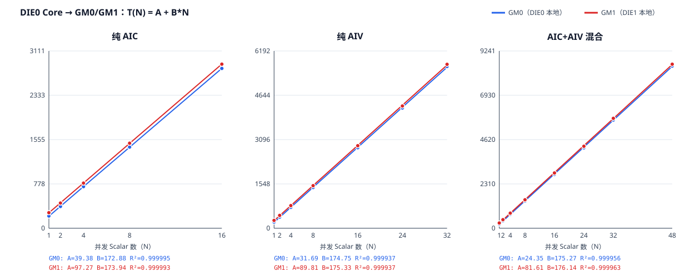

# 同地址 Atomic 并发曲线验证

## 结论与术语

本探针验证多个 Scalar 同时对同一地址执行一次 `atomicAdd(+1)` 时，
整批返回时间能否用下式描述：

\[
T(N) = A + B N
\]

其中，`N` 是活跃 Scalar 数量，`T(N)` 是该批 Atomic 的设备侧完整
跨度。`A` 是拟合出的固定或可重叠项，`B` 是每增加一个参与者带来的
边际成本。

本文中的 GM0、GM1 是操作性命名：

- GM0：双向单核时延证明该目标地址对 DIE0 Core 更近，即 DIE0 本地；
- GM1：双向单核时延证明该目标地址对 DIE1 Core 更近，即 DIE1 本地；
- DIE0 Core → GM0 是同 DIE 访问；
- DIE0 Core → GM1 是跨 DIE 访问。

GM0、GM1 不是 CANN 接口返回的 HA 编号，也不是根据虚拟地址位推测
出来的物理归属。本次测试先用实测时延分类地址，再用 AIC 和 AIV 的
双向对照复核分类。

2026-08-03 的正式采集得到：六条曲线都达到强拟合门槛，最低 R² 为
0.999927。R² 是直线对各个 `N` 点变化的解释程度，越接近 1，说明点越
贴近直线；它不代表测量没有系统误差，也不能单独证明对 A、B 的物理
归因。

从 GM0 换到 GM1 后，差异主要落在截距 A：

| Scalar 组成 | ΔA（ns） | ΔB（ns/Scalar） | ΔT(1)（ns） |
| ----------- | -------: | --------------: | ----------: |
| 纯 AIC | 57.896 | 1.065 | 58.961 |
| 纯 AIV | 58.123 | 0.582 | 58.705 |
| AIC+AIV 混合 | 57.258 | 0.864 | 58.122 |

这里必须同时看 A 和 B。因为 `T(1)=A+B`，所以 N=1 的跨 DIE 差值为
`ΔT(1)=ΔA+ΔB`，不能只拿两条斜率相减来理解。

## 测试设计

### 场景与容量

所有进入主曲线的活跃 Core 都由 `get_coreid()` 确认位于物理 DIE0。
每种 Scalar 组成分别访问 GM0 和 GM1，一共六条曲线。

请求的 `N` 固定为：

```text
1, 2, 4, 8, 16, 24, 32, 48, 64, 80, 96
```

DIE0 实际能容纳 16 个 AIC 和 32 个 AIV，因此进入拟合的点为：

| Scalar 组成 | 进入拟合的 `N` | 最大并发数 |
| ----------- | -------------- | ---------: |
| 纯 AIC | 1、2、4、8、16 | 16 |
| 纯 AIV | 1、2、4、8、16、24、32 | 32 |
| AIC+AIV 混合 | 1、2、4、8、16、24、32、48 | 48 |

其余请求点在 GM0、GM1 两组原始数据中都写为 `UNSUPPORTED`，不会
外推，也不会进入拟合。

### 物理放置

小 `block_dim` 会让 block 分布到两个 DIE，不能用“启动的前 N 个
block”直接代表 DIE0。主曲线固定启动完整拓扑，再只激活 DIE0 前缀：

| 场景 | 固定启动形状 | 活跃前缀 |
| ---- | ------------ | -------- |
| 纯 AIC | 32 个 AIC slot | 前 N 个 AIC |
| 纯 AIV | 64 个 AIV slot | 前 N 个 AIV |
| 混合 | 32 个 `1C:2V` block，共 96 个 slot | 前 N 个 `C,V,V` 位置 |

未激活的 slot 只参加首次起跑同步，不执行被测 Atomic。host 对每个
参与者检查真实物理核编号、AIC/AIV 类型、唯一性和 DIE；混合场景还会
检查一个 AIC 与两个 AIV 是否属于同一物理 triplet。

### GM 归属分类

host 会扫描 32 个 2 MiB 页中的 128 个候选地址。每个候选地址分别由
DIE0 和 DIE1 上固定的 AIV 执行 N=1 测量，各重复 3 次：

- DIE0 中位数至少快 32 tick，分类为 GM0；
- DIE1 中位数至少快 32 tick，分类为 GM1；
- 差值不足 32 tick，分类为不明确并继续扫描；
- 找不到两类地址则测试失败，不生成拟合结论。

扫描不会在遇到第一对地址时提前停止。分类完成后，在 GM0、GM1 候选中
选择两者“各自在本地 DIE 上”的 N=1 中位数最接近的一对，并要求差值不
超过 8 tick。这项门禁用于避免把不同地址或 HA 档位的本地性能差异误写
成跨 DIE 成本。

选出地址后，再执行 30 次完整的 AIC/AIV 双向 N=1 对照。正式采集的
镜像证据为：

| Scalar | 目标 | DIE0 Core（ns） | DIE1 Core（ns） | 更快的 DIE |
| ------ | ---- | --------------: | --------------: | ---------: |
| AIC | GM0 | 215 | 291 | DIE0 |
| AIV | GM0 | 216 | 292 | DIE0 |
| AIC | GM1 | 273 | 215 | DIE1 |
| AIV | GM1 | 274 | 216 | DIE1 |

因此，本次报告中的 GM1 确实表示“对 DIE1 Core 本地”的目标地址；
DIE0 Core 访问 GM1 就是跨 DIE。地址数值只用于闭合本次 raw 的一致性，
下一次分配可能变化，不能把本次虚拟地址位写成通用归属规则。

### 设备侧计时

每次 launch 包含 68 个 wave：前 4 个预热，后 64 个计量。每个活跃
Scalar 在每个 wave 中恰好执行一次 Atomic。

所有启动 Scalar 先在独立 cache line 上完成 ready 同步。最后到达者
发布未来 100 微秒处的第一个 `SYS_CNT` deadline，后续 wave 间隔固定为
100 微秒。对参与者 `i`，被测区间为：

```text
begin_i = 紧贴 Atomic 之前读取 SYS_CNT
old_i   = atomicAdd(shared_target, 1)
end_i   = 消费 old_i 后读取 SYS_CNT
```

`old_i` 的数据依赖保证结束时间戳不会越过 Atomic 返回。计时区间中没有
DSB、DCCI 和结果写回。每个 wave 的主观测量为：

```text
global_span = max_i(end_i) - min_i(begin_i)
```

每个 wave 在 deadline 后 50 微秒才进入固定结果发布阶段。计量必须在
发布阶段前结束，发布必须在下一个 wave 前结束，否则 launch 失败。
平台 `SYS_CNT` 为 1 GHz，所以 1 tick 按 1 ns 折算。

### 有效性门禁

进入拟合前会逐行检查：

- 目标地址非零、64 字节对齐，同一 GM 组始终使用同一个地址；
- GM0 和 GM1 使用不同地址，曲线地址与镜像复核地址完全相同；
- 每条主曲线的活跃物理核都在 DIE0；
- 每个 launch 的核放置在全部 wave 中不变；
- 返回旧值严格构成 `[w*N, (w+1)*N-1]` 的全排列；
- 最终 target 等于 `N*68`，时间戳、guard 和发布阶段全部闭合；
- 正式 wave 的 `start_spread` 不超过 64 tick；
- 预热和正式 wave 数量、30 个 sweep 以及不支持点都完整存在。

任一条件失败，分析器都会拒绝整份结果，不静默补值或删样本。

## 统计方法

采集顺序在场景、GM 目标以及 N 的升降序之间轮换，降低固定顺序带来的
温漂偏差。统计不删除异常值：

1. 每次 launch 对 64 个正式 wave 的 `global_span` 取中位数；
2. 每个 `(场景, GM, N)` 对 30 个 launch 中位数计算 P10、P50、P90；
3. 每个 N 等权，用普通最小二乘拟合 `T(N)=A+B*N`；
4. 输出 A、B、T(1)、R²、均方根误差、预测值和逐点残差。

拟合参数只能用作一阶描述。仅凭曲线不能把 A 精确等同为 SoC 总线阶段，
也不能把 B 精确等同为 HA 内部服务时间。

## 实测结果

正式采集的拟合结果如下：

| 场景 | A（ns） | B（ns/Scalar） | T(1)（ns） | R² |
| ---- | ------: | -------------: | ---------: | -: |
| 纯 AIC：DIE0 → GM0 | 39.375 | 172.875 | 212.250 | 0.999995 |
| 纯 AIC：DIE0 → GM1 | 97.271 | 173.940 | 271.211 | 0.999993 |
| 纯 AIV：DIE0 → GM0 | 31.689 | 174.746 | 206.435 | 0.999937 |
| 纯 AIV：DIE0 → GM1 | 89.811 | 175.328 | 265.140 | 0.999937 |
| 混合：DIE0 → GM0 | 24.351 | 175.274 | 199.625 | 0.999956 |
| 混合：DIE0 → GM1 | 81.609 | 176.138 | 257.747 | 0.999963 |

三类同 DIE 曲线的 B 为 172.9--175.3 ns/Scalar，跨 DIE 曲线的 B 为
173.9--176.1 ns/Scalar，本次差值只有 0.3%--0.6%。相比之下，跨 DIE
的 A 增加约 57--58 ns。数据因此支持：同地址 Atomic 的主要增长项仍
近似线性串行，跨 DIE 额外成本主要是固定路径延迟。

使用同一“本地基准差为 0”的配对门禁做独立复核时，ΔA 为
51.4--52.8 ns，ΔB 为 -2.2 至 -1.5 ns/Scalar。两次采集中 ΔB 的方向
发生翻转，但相对值始终在约 1.3% 内；因此不把约 1--2 ns/Scalar 的
正负变化解释成稳定的跨 DIE 吞吐差异。更稳健的结论是两组 B 近似相同，
固定项增加约 51--58 ns。不同地址对仍会带来可见路径差异，不能把单次
分配的 ΔA 当成所有 DIE1 GM 地址的唯一常数。

### N=1 与泳道中约 200 ns 的关系

全区间回归得到的 `A+B` 是拟合在 N=1 的预测值，不等于 N=1 实测点。
应直接比较 N=1 的 launch 中位数：

| 场景 | GM0 实测 N=1（ns） | GM1 实测 N=1（ns） |
| ---- | -----------------: | -----------------: |
| 纯 AIC | 215 | 273 |
| 纯 AIV | 216 | 274 |
| 混合 | 215 | 273 |

这次带 `get_coreid()` 的定点结果把旧泳道中的双档解释收紧了：约 200 ns
与同 DIE 的 215--216 ns 属于同一快档量级；跨 DIE 则稳定在
273--274 ns。旧泳道 raw 没有真实物理核编号，所以不能把其中每一条旧
记录事后指定到某个 DIE，但新的受控测量已经证明 DIE 放置足以产生这两
个量级。



## 运行与产物

只构建：

```bash
tests/atomic_probe/ccec/run_atomic_contention_curve.sh build
```

本机独占设备上直接构建、采集、分析：

```bash
tests/atomic_probe/ccec/run_atomic_contention_curve.sh all
```

只重新分析已有压缩 raw：

```bash
tests/atomic_probe/ccec/run_atomic_contention_curve.sh analyze
```

若环境提供 `task-submit`，按仓库设备隔离规则把 `all` 命令放在同一个
设备锁内执行。设备号来自 `ATOMIC_PROBE_DEVICE`；在 `task-submit` 中可
由 `TASK_DEVICE` 传入。

结果目录包含：

- `raw_aic_gm0.tsv.xz`、`raw_aic_gm1.tsv.xz`；
- `raw_aiv_gm0.tsv.xz`、`raw_aiv_gm1.tsv.xz`；
- `raw_mixed_gm0.tsv.xz`、`raw_mixed_gm1.tsv.xz`；
- `raw_locality.tsv.xz`：八组 AIC/AIV、DIE0/DIE1 镜像证据；
- `summary.json`：完整校验、逐点统计和拟合参数；
- `report.md`：由分析器生成的中文结果表；
- `curve.svg`：GM0、GM1 配对曲线。

更早的 Atomic 探针背景和计数器频率依据见
[`test_case.md`](test_case.md)。
