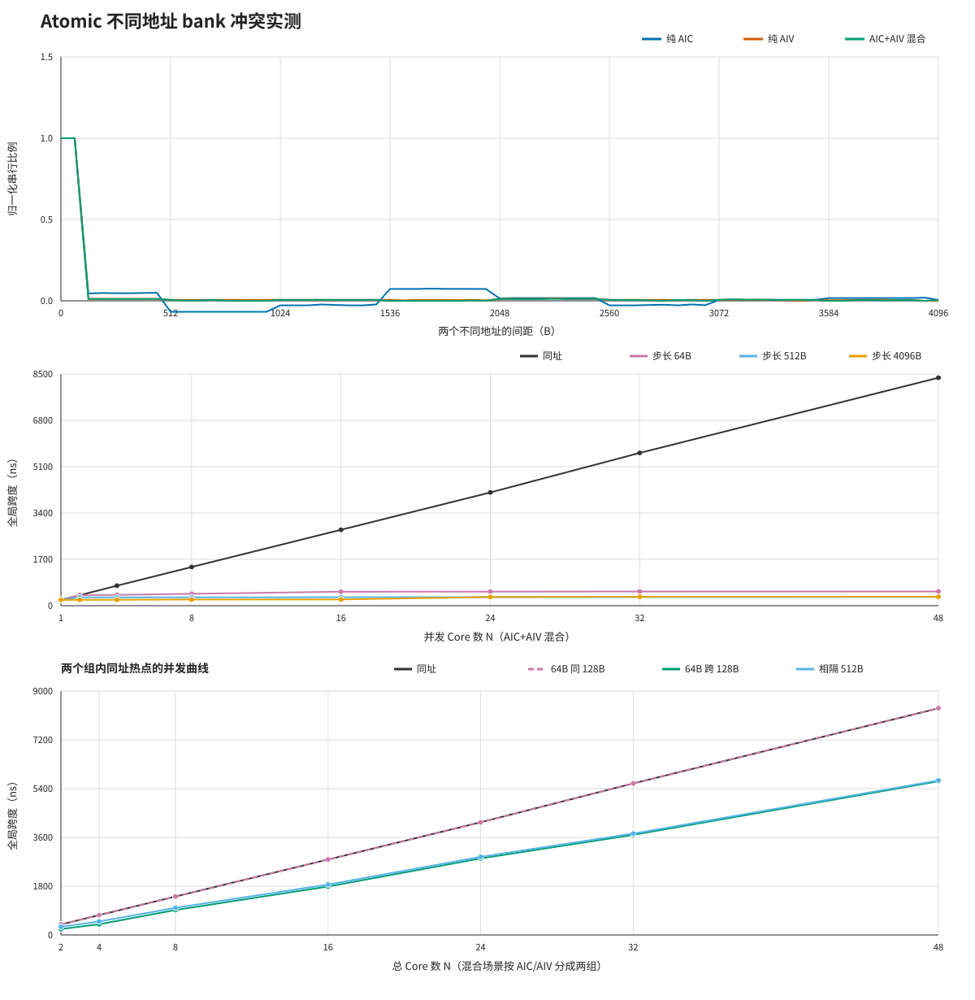

# Atomic 不同地址的 L2 bank 冲突实测

## 结论

**真实两组热点场景：两组热点位于同一 128B 冲突单元时合并成 B×(nA+nB)；跨 128B 后按 B×max(nA,nB) 并行。**

独立地址粒度结论：512B 共 bank 全串行的说法不成立；但仅隔离 64B 不安全，观察到 128B 冲突粒度。

对原始说法的判定是：**不支持“同一 512B 区间内不同 64B 行仍按同址 B 排队”的说法**。这里的结论只来自地址偏移与时延形态，不把设备虚拟地址直接当作公开的 bank 编号。

## N 个 Core 分成两个同址热点组

纯 AIC/AIV 近半分组；混合场景按 AIC→组 A、AIV→组 B。`B总核数` 是对总 Core 数 N 的斜率，`B最大组` 是对 `max(nA,nB)` 的斜率。若两组队列合并，前者应接近同址 B；若两组并行，后者应接近同址 B。

| 场景 | 同址 B/ns | 64B 同 128B：B总核数/同址 | 64B 跨边界：B最大组/同址 | 128B：B最大组/同址 | 512B：B最大组/同址 | 1024B：B最大组/同址 |
|---|---:|---:|---:|---:|---:|---:|
| 纯 AIC | 170.45 | 1.000 | 1.024 | 1.025 | 0.995 | 1.005 |
| 纯 AIV | 172.78 | 1.000 | 1.016 | 1.016 | 0.984 | 0.991 |
| AIC+AIV 混合 | 173.42 | 1.000 | 1.011 | 1.011 | 0.999 | 1.000 |

纯 AIC/AIV 的两组近似等大，`N` 与 `max(nA,nB)` 成固定倍数，单靠 R² 不能区分模型。混合场景的分组比例会随 N 取整变化，因此是主要判据：64B 同一 128B 区间按总核数拟合时 R²=0.999957、RMSE=17.62ns，优于按最大组拟合的 R²=0.999559、RMSE=56.41ns；跨 128B 后关系反转，按最大组拟合的 R²=0.999929、RMSE=15.50ns，优于按总核数拟合的 R²=0.999581、RMSE=37.65ns。

每个拟合的完整 A、B、R²、RMSE 和各 N 点 P10/P50/P90 均保存在 `summary.json`。

## 两个 Core、两个不同地址

串行比例定义为：`(双地址实测 - 两次单核的并行基线) / (同址双核 - 同址单核基线)`。接近 1 表示虽然地址不同，额外耗时仍接近同址排队；接近 0 表示两次 atomic 基本并行。

| 场景 | 同址双核 P50/ns | 间距 64B 串行比例 | 间距 128B 串行比例 | 间距 512B 串行比例 | 首个近似并行间距 |
|---|---:|---:|---:|---:|---:|
| 纯 AIC | 392.0 | 1.000 | 0.045 | -0.068 | 128B |
| 纯 AIV | 387.0 | 1.000 | 0.012 | 0.006 | 128B |
| AIC+AIV 混合 | 386.0 | 1.000 | 0.012 | 0.006 | 128B |

间距 64B 时三类组合都与同址一样完整串行；但同在首个 512B 区间内的 128/192/256/320/384/448B 间距均已接近并行。因此，实测不能支持“整个 512B 区间共用一条 B≈170ns 队列”。

## 相邻 64B 地址的 128B 相位验证

| 场景 | 两地址落在同一 128B 区间时的串行比例 | 两地址跨 128B 边界时的串行比例 | 是否呈 128B 交替 |
|---|---:|---:|---:|
| 纯 AIC | 1.000 | 0.046 | 是 |
| 纯 AIV | 1.000 | 0.012 | 是 |
| AIC+AIV 混合 | 1.000 | 0.012 | 是 |

相邻地址对的起点每次平移 64B：`+0/+128/+256/+384B` 落在同一 128B 区间，`+64/+192/+320/+448B` 跨越 128B 边界。这个相位实验用于区分“固定 gap=64B 的偶然地址映射”与 128B 冲突粒度。

## 多 Core、每 Core 独立地址

非同址曲线明显不是 `A+B×N`：64B/256B/512B 的低 N 拟合 R² 很低，不能把其拟合斜率解释成单条 HA 队列的 B。因此下表直接给出最大并发点的实测中位数。

| 场景 | 最大 N | 同址/ns | 步长 64B/ns | 步长 128B/ns | 步长 512B/ns | 步长 1024B/ns | 最快独立步长 | 相对同址加速 |
|---|---:|---:|---:|---:|---:|---:|---:|---:|
| 纯 AIC | 16 | 2778.0 | 503.0 | 306.0 | 306.0 | 227.0 | 1024B | 12.24× |
| 纯 AIV | 32 | 5589.0 | 514.2 | 315.0 | 318.0 | 238.8 | 1024B | 23.41× |
| AIC+AIV 混合 | 48 | 8362.2 | 522.8 | 325.0 | 321.8 | 254.0 | 1024B | 32.92× |

## 测试方法

- 固定 DIE0 Core → GM0，GM0 基址按 512B 对齐，并限制扫描范围不跨 2MiB 候选页。
- 每个 launch 先做 4 个预热 wave，再做 64 个计量 wave；共 10 次顺序轮换的 sweep。
- 所有 Core 等待同一个未来 SYS_CNT 截止点；计时区间内只有一次 `atomicAdd`，结果发布在固定后半 wave。
- 双 Core 扫描覆盖 0–4096B、步长 64B，并分别测 C+C、V+V、C+V。每个偏移另测 AIC/AIV 单核基线。
- 另将相邻 64B 地址对的起点在一个 512B 区间内逐 64B 平移；每个相位同时测同址对照。
- 多 Core 扫描比较同址及 64/128/256/512/1024/2048/4096B 步长；非零步长下每个 Core 都访问独立地址。
- 两组热点扫描覆盖同址、相隔 64B 且同处一个 128B 区间、相隔 64B 但跨 128B 边界，以及相隔 128/512/1024B；纯 AIC/AIV 近半分组，混合场景按 AIC/AIV 分组。
- host 校验完整目标区和每个 wave 的 atomic 返回值；独立地址必须各自从 0 连续增长到 67，两组热点必须分别形成各自完整的连续旧值序列。

## 数据质量与限制

- 原始数据 431800 行，6350 个 launch，其中计量 wave 406400 行；语义与时序校验全部通过。
- SYS_CNT 频率按 1GHz，因而 1 tick = 1ns。表中 P10/P50/P90 的独立样本层级是每个 launch 的 64-wave 中位数。
- 512B bank 归因属于由地址周期和性能台阶反推的结论；若 bank 选择还包含更高位哈希，需要结合完整 4KiB 扫描解释，不能只看 `gap=512B` 单点。
- 本测试测的是一次 atomic 返回就绪的全局完成跨度，不代表带其他访存或调度逻辑的完整业务 kernel。

## 可复现信息

- 源码版本：`21dc431dc37a+dirty`
- 原始证据：`raw_samples.tsv.xz`
- 原始证据 SHA-256：`ddc8095af4b9838e878dde6fc9d71a3b6ae16a7bcd0563d56814a03caeda03c0`
- 执行：`tests/atomic_probe/ccec/run_atomic_bank_conflict.sh all`
